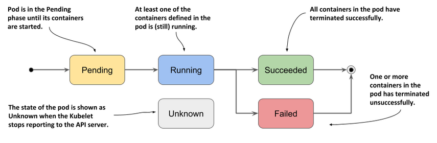
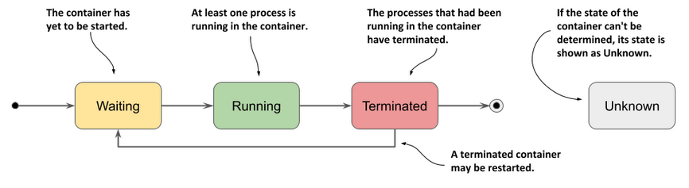
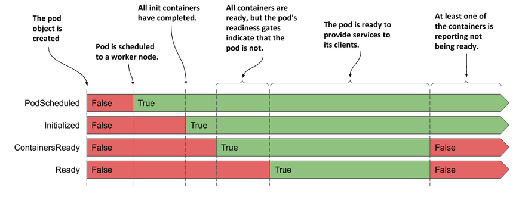
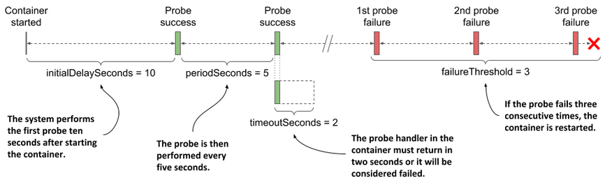
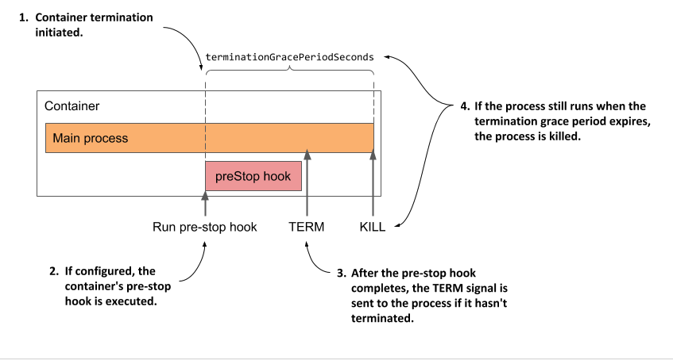
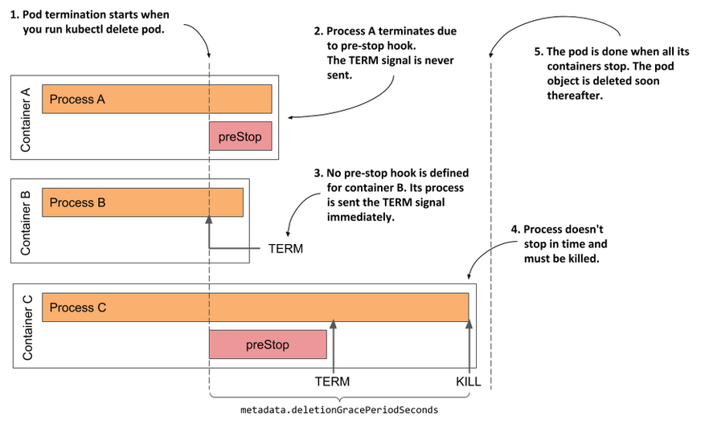

Pods follow a defined lifecycle, starting in the __Pending__ phase, moving through __Running__ if at least one of its primary containers starts OK, and then through either the __Succeeded__ or __Failed__ phases depending on whether any container in the Pod terminated in failure.

While a Pod is running, the kubelet is able to restart containers to handle some kind of faults. Within a Pod, Kubernetes tracks different container states and determines what action to take to make the Pod healthy again.

In the Kubernetes API, pods have both a specification and an actual status. The status for a Pod object consists of a set of Pod conditions. You can also inject custom readiness information into the condition data for a Pod, if that is useful to your application.

Pods are only scheduled once in their lifetime. Once a Pod is scheduled (assigned) to a Node, the Pod runs on that Node until it stops or is terminated.


=== cli tools 

TIP: for Windows users can install https://git-scm.com/download/win[git bash], which emulates a bash environment on windows. It lets you use all git features in command line plus most of standard unix commands. It has a portable version, very useful in the following chapters due all examples are linux based.

==== About the OpenShift CLI

With the OpenShift command-line interface (CLI), the oc command, you can create applications and manage OpenShift Container Platform projects from a terminal. The OpenShift CLI is ideal in the following situations:

* Working directly with project source code
* Scripting OpenShift Container Platform operations
* Managing projects while restricted by bandwidth resources and the web console is unavailable

==== Installing the OpenShift CLI

Check the documentation https://docs.openshift.com/container-platform/4.7/cli_reference/openshift_cli/getting-started-cli.html[getting started cli]

===== Installing the OpenShift CLI on Linux

You can install the OpenShift CLI (oc) either by downloading the binary or by using an RPM. we are going to download the binaries following the procedure: 

```bash
# Set variable openshift_cli to get lastest binary version 

$ openshift_cli=$(curl -s https://mirror.openshift.com/pub/openshift-v4/clients/ocp/latest/ | grep -E "openshift-client-linux-.*.tar.gz" | sed -r 's/.*href="([^"]+).*/\1/g')

# Download the binary

$ curl https://mirror.openshift.com/pub/openshift-v4/clients/ocp/latest/$openshift_cli --output $openshift_cli

# Uncompress the binary at the /usr/local/bin/ path 

$ tar -xvzf $openshift_cli -C /usr/local/bin/
$ oc completion bash >/etc/bash_completion.d/openshift
```

===== Installing the OpenShift CLI on Windows

You can install the OpenShift CLI (oc) binary on Windows by using the following procedure.

1. Navigate to the https://mirror.openshift.com/pub/openshift-v4/clients/ocp/latest/[Infrastructure Provider page] on the Red Hat OpenShift Cluster Manager site.

2. Select your infrastructure provider, and, if applicable, your installation type.

3. In the Command-line interface section, select Windows from the drop-down menu and click Download command-line tools.

3. Unzip the archive with a ZIP program.

4. Move the oc binary to a directory that is on your PATH.

5. To check your PATH, open the command prompt and execute the following command:

```bash
C:\> path
```
6. After you install the CLI, it is available using the oc command:


```bash
C:\> oc <command>
```

IMPORTANT: To get the official documentation please check the link https://docs.openshift.com/container-platform/4.7/cli_reference/openshift_cli/getting-started-cli.html[getting started cli]

=== Pod definition example


* Let's create a Pod with two containers to break it down piece by piece.

TIP: The example-pod manifest has been generated with env variables which should match with you registry and images names, so you must set it before execute the oc apply.

```bash
$ export EXTERNAL_REGISTRY=registry.docp4.lab.bcnconsulting.com:5000
$ export POSTGRES_IMAGE=poc/postgresql-10:latest
$ export GOGS_IMAGE=poc/gogs:latest
```

```bash
$ cat << EOF |oc apply -f -
include::kubernetes-manifests-example/example-pod.yml[] 
EOF
```

=== Pod phase 


The phase of a Pod is a simple, high-level summary of where the Pod is in its lifecycle. The phase is not intended to be a comprehensive rollup of observations of container or Pod state, nor is it intended to be a comprehensive state machine.

The number and meanings of Pod phase values are tightly guarded. Other than what is documented here, nothing should be assumed about pods that have a given phase value.



NOTE: When a Pod is being deleted, it is shown as __Terminating__ by some kubectl commands. This __Terminating__ status is not one of the Pod phases. A Pod is granted a term to terminate gracefully, which defaults to 30 seconds. You can use the flag `--force` to terminate a Pod by force.

If a node dies or is disconnected from the rest of the cluster, Kubernetes applies a policy for setting the phase of all Pods on the lost node to Failed.

=== Container states

As well as the phase of the Pod overall, Kubernetes tracks the state of each container inside a Pod

Once the scheduler assigns a Pod to a Node, the kubelet starts creating containers for that Pod using a container runtime. There are three possible container states: __Waiting__, __Running__, and __Terminated__.

.container states


Each state has a specific meaning:

* **Waiting**: If a container is not in either the Running or Terminated state, it is Waiting. A container in the Waiting state is still running the operations it requires in order to complete start up: for example, pulling the container image from a container image registry, or applying Secret data. When you use kubectl to query a Pod with a container that is Waiting, you also see a __Reason__ field to summarize why the container is in that state.

* **Running**: The Running status indicates that a container is executing without issues. If there was a __postStart__ hook configured, it has already executed and finished. When you use kubectl to query a Pod with a container that is Running, you also see information about when the container entered the Running state.

* **Terminated**: A container in the Terminated state began execution and then either ran to completion or failed for some reason. When you use kubectl to query a Pod with a container that is Terminated, you see a reason, an exit code, and the start and finish time for that container's period of execution. If a container has a __preStop__ hook configured, that runs before the container enters the Terminated state.


Let's create a Pod with the <<Pod definition example>> and follow its phases in the terminal:

```bash
$ watch "oc get pod/example-pod  -o json | jq '.status.phase'"
...
Every 5.0s:  oc get pod/example-pod  -o json | jq '.status.phase'                                                                                                                          Thu Apr 15 21:11:45 2021
"Pending"
...
Every 5.0s:  oc get pod/example-pod  -o json | jq '.status.phase'                                                                                                                          Thu Apr 15 21:11:50 2021
"Running"
```

Now we can delete the pod.

```bash
$ oc delete pod/example-pod
```

=== Container restart policy


The spec of a Pod has a __restartPolicy__ field with possible values Always, OnFailure, and Never. The default value is Always.

The __restartPolicy__ applies to all containers in the Pod. It only refers to restarts of the containers by the kubelet on the same node. After containers in a Pod exit, the kubelet restarts them with an exponential back-off delay (10s, 20s, 40s, …), that is capped at five minutes. Once a container has executed for 10 minutes without any problems, the kubelet resets the restart backoff timer for that container.

=== Pod conditions


A Pod has a __PodStatus__, which has an array of __PodConditions__ through which the Pod has or has not passed:

.container states


* **PodScheduled**: the Pod has been scheduled to a node.
* **ContainersReady**: all containers in the Pod are ready.
* **Initialized**: all init containers have started successfully.
* **Ready**: the Pod is able to serve requests and should be added to the load balancing pools of all matching Services.

Let's try it in the terminal. First recreate following the <<Pod definition example>> procedure.

```bash
$ watch "oc get pod/example-pod  -o json | jq '.status.conditions'"
...
[
  {
    "lastProbeTime": null,
    "lastTransitionTime": "2021-04-15T17:04:11Z",
    "status": "True",
    "type": "Initialized"
  },
  {
    "lastProbeTime": null,
    "lastTransitionTime": "2021-04-15T17:04:16Z",
    "status": "True",
    "type": "Ready"
  },
  {
    "lastProbeTime": null,
    "lastTransitionTime": "2021-04-15T17:04:16Z",
    "status": "True",
    "type": "ContainersReady"
  },
  {
    "lastProbeTime": null,
    "lastTransitionTime": "2021-04-15T17:04:11Z",
    "status": "True",
    "type": "PodScheduled"
  }
]
```
Now we can delete the pod.

```bash
$ oc delete pod/example-pod
```

=== Pod readiness

Your application can inject extra feedback or signals into __PodStatus__: Pod readiness. To use this, set __readinessGates__ in the Pod's spec to specify a list of additional conditions that the kubelet evaluates for Pod readiness.

Readiness gates are determined by the current state of status.condition fields for the Pod. If Kubernetes cannot find such a condition in the status.conditions field of a Pod, the status of the condition is defaulted to "False".

Here is an example:

```yaml
kind: Pod
...
spec:
  readinessGates:
    - conditionType: "www.example.com/feature-1"
status:
  conditions:
    - type: Ready                              # a built in PodCondition
      status: "False"
      lastProbeTime: null
      lastTransitionTime: 2018-01-01T00:00:00Z
    - type: "www.example.com/feature-1"        # an extra PodCondition
      status: "False"
      lastProbeTime: null
      lastTransitionTime: 2018-01-01T00:00:00Z
  containerStatuses:
    - containerID: docker://abcd...
      ready: true
...
```

=== Status for Pod readiness


The kubectl patch command does not support patching object status. To set these status.conditions for the pod, applications and operators should use the PATCH action. You can use a Kubernetes client library to write code that sets custom Pod conditions for Pod readiness.

For a Pod that uses custom conditions, that Pod is evaluated to be ready only when both the following statements apply:

    All containers in the Pod are ready.
    All conditions specified in readinessGates are True.

When a Pod's containers are Ready but at least one custom condition is missing or False, the kubelet sets the Pod's condition to ContainersReady.


=== Container probes


A Probe is a diagnostic performed periodically by the kubelet on a Container. To perform a diagnostic, the kubelet calls a Handler implemented by the container. There are three types of handlers:

1. *ExecAction*: Executes a specified command inside the container. The diagnostic is considered successful if the command exits with a status code of 0.

2. *TCPSocketAction*: Performs a TCP check against the Pod's IP address on a specified port. The diagnostic is considered successful if the port is open.

3. *HTTPGetAction*: Performs an HTTP GET request against the Pod's IP address on a specified port and path. The diagnostic is considered successful if the response has a status code greater than or equal to 200 and less than 400.

Each probe has one of three results:

1. *Success*: The container passed the diagnostic.
2. *Failure*: The container failed the diagnostic.
3. *Unknown*: The diagnostic failed, so no action should be taken.

The kubelet can optionally perform and react to three kinds of probes on running containers:

* *livenessProbe*: Indicates whether the container is running. If the liveness probe fails, the kubelet kills the container, and the container is subjected to its restart policy. If a Container does not provide a liveness probe, the default state is Success.

* *readinessProbe*: Indicates whether the container is ready to respond to requests. If the readiness probe fails, the endpoints controller removes the Pod's IP address from the endpoints of all Services that match the Pod. The default state of readiness before the initial delay is Failure. If a Container does not provide a readiness probe, the default state is Success.

* *startupProbe*: Indicates whether the application within the container is started. All other probes are disabled if a startup probe is provided, until it succeeds. If the startup probe fails, the kubelet kills the container, and the container is subjected to its restart policy. If a Container does not provide a startup probe, the default state is Success.

.Pod Probe



=== Termination of Pods


Because Pods represent processes running on nodes in the cluster, it is important to allow those processes to gracefully terminate when they are no longer needed (rather than being abruptly stopped with a KILL signal and having no chance to clean up).

The design aim is for you to be able to request deletion and know when processes terminate, but also be able to ensure that deletes eventually complete. When you request deletion of a Pod, the cluster records and tracks the intended grace period before the Pod is allowed to be forcefully killed. With that forceful shutdown tracking in place, the kubelet attempts graceful shutdown.

Typically, the container runtime sends a TERM signal to the main process in each container. Many container runtimes respect the STOPSIGNAL value defined in the container image and send this instead of TERM. Once the grace period has expired, the KILL signal is sent to any remaining processes, and the Pod is then deleted from the API Server. If the kubelet or the container runtime's management service is restarted while waiting for processes to terminate, the cluster retries from the start including the full original grace period.


.Pod Termination Simplier


.Pod Termination Detailed



TIP: For a deep dive about the full process over kubernetes take a look at https://github.com/jamiehannaford/what-happens-when-k8s[What happens when ... Kubernetes edition!], which describe it pretty detailed for a deeper understanding about all kubernetes processes under the hood.

=== Pods vs Linux Namespaces

Let's contrast what we've learned until now, creating two pods: *_BUDA_* and *_PEST_*. Each of them will be running a python http.server inside container exporting diferent port. 

1. Create a shared storage to be used by the two pods.

```bash
$ cat << EOF |oc apply -f -
include::kubernetes-manifests-example/example-pod-pv-pvc-share.yml[] 
EOF
```

2. Create the pod BUDA

```bash
$ cat << EOF |oc apply -f -
include::kubernetes-manifests-example/example-pod-buda.yml[] 
EOF
```

3. Create the pod PEST
```bash
$ cat << EOF |oc apply -f -
include::kubernetes-manifests-example/example-pod-pest.yml[] 
EOF
```

4. Check events

```bash
...
5m12s       Normal    Scheduled        pod/example-pod-buda   Successfully assigned workshop-user1/example-pod-buda to dworker00
5m10s       Normal    AddedInterface   pod/example-pod-buda   Add eth0 [172.0.4.203/24]
5m9s        Normal    Pulled           pod/example-pod-buda   Container image "quay.io/silvinux/alpine-net:latest" already present on machine
5m9s        Normal    Created          pod/example-pod-buda   Created container container-buda
5m9s        Normal    Started          pod/example-pod-buda   Started container container-buda
2s          Normal    Scheduled        pod/example-pod-pest   Successfully assigned workshop-user1/example-pod-pest to dworker00
0s          Normal    AddedInterface   pod/example-pod-pest   Add eth0 [172.0.4.204/24]
0s          Normal    Pulled           pod/example-pod-pest   Container image "quay.io/silvinux/alpine-net:latest" already present on machine
0s          Normal    Created          pod/example-pod-pest   Created container container-pest
0s          Normal    Started          pod/example-pod-pest   Started container container-pest
...
```

Let's try to run some commands inside the pods to check if we can communicate between them.

Enter in *BUDA's* container and execute.

```bash
$ oc rsh example-pod-buda
$ pwd
$ uname -n 
$ ps -ef
$ echo $(uname -n) >> test-from-container.txt
$ cat  test-from-container.txt
$ ip ad
$ ping -c4 $ip-pest

```

Enter in *PEST's* container and execute.

```bash
$ oc rsh example-pod-pest
$ pwd
$ ps -ef
$ ls -la
$ cat  test-from-container.txt
$ echo $(uname -n) >> test-from-container.txt
$ cat  test-from-container.txt
$ ip ad
$ ping -c4 $ip-buda
```

On both pods we can see the following:

1. Processes and *_${PORT_CONTAINER}_* are different and isolated on both pods.
2. They are using the *_shared storage_*.
3. Processes are runnning with the *user _container_*, which was instructed by the Dockerfile when we created the image.
4. Pods are able to communicate through their *_network stack_*.

Let's try now to ckeck the limits, to see  it works, creating the dump eater memory python script and executing in both pods.

From *BUDA* pod the script should be ended with an __Exit code 137__. This means that your process was killed by (signal 9) SIGKILLkilled, because we configure resources limits into the pod's manifest, allowing kubernetes to create a cgroup to handles this. 

```yml
...
      resources:
        limits:
          cpu: "200m"
          memory: 200Mi
        requests:
          cpu: "200m"
          memory: 200Mi
...          
```

```bash
$ cat <<EOF > /app/shared/dumb.py
f = open("/dev/urandom", "r", encoding = "ISO-8859-1")
data = ""
i=0
while i < 20:
   data += f.read(10000000) # 10mb
   i += 1
   print("Used %d MB" % (i * 10))
EOF
$ python3 /app/shared/dumb.py
Used 10 MB
Used 20 MB
Used 30 MB
Used 40 MB
Used 50 MB
Used 60 MB
Used 70 MB
Used 80 MB
Used 90 MB
Used 100 MB
Used 110 MB
Used 120 MB
Used 130 MB
Used 140 MB
Used 150 MB
Used 160 MB
Used 170 MB
command terminated with exit code 137
```

*PEST* pod limits's has been set to 300Mi. 

```yml
...   
      resources:
        limits:
          cpu: "250m"
          memory: 300Mi
        requests:
          cpu: "250m"
          memory: 300Mi
...   
```

Because of the former statement, the script will end OK in *PEST* pod because the script will be run until the memory consumption reach 200Mb

```bash
$ python3 /app/shared/dumb.py
Used 10 MB
Used 20 MB
Used 30 MB
Used 40 MB
Used 50 MB
Used 60 MB
Used 70 MB
Used 80 MB
Used 90 MB
Used 100 MB
Used 110 MB
Used 120 MB
Used 130 MB
Used 140 MB
Used 150 MB
Used 160 MB
Used 170 MB
Used 180 MB
Used 190 MB
Used 200 MB
/app/shared $
```

Now we can check if kubernetes really creates a cgroups as we did in our previous examples. 

Let's get the pod's containerIDs.

```bash
$ POD_BUDA_CONTAINERID=$(oc get pod example-pod-buda -ojson |jq -r '.status.containerStatuses[].containerID'|awk -F/ '{print $3}')

$ POD_PEST_CONTAINERID=$(oc get pod example-pod-pest -ojson |jq -r '.status.containerStatuses[].containerID'|awk -F/ '{print $3}') 

echo "cat /sys/fs/cgroup/memory/kubepods.slice/kubepods-pod*/crio-${POD_BUDA_CONTAINERID}.scope/memory.limit_in_bytes"

echo "cat /sys/fs/cgroup/memory/kubepods.slice/kubepods-pod*/crio-${POD_PEST_CONTAINERID}.scope/memory.limit_in_bytes"
```

We need to know on which node is running our pods and check it inside that node. 

IMPORTANT: You must admin to performe the following commands. We are going get into the node through the oc debug command, used to login into a node.   

```bash
$ oc get pods -owide
NAME                      READY   STATUS    RESTARTS   AGE    IP            NODE        NOMINATED NODE   READINESS GATES
example-pod-buda          1/1     Running   1          36m    172.0.4.203   dworker00   <none>           <none>
example-pod-pest          1/1     Running   0          43m    172.0.4.204   dworker00   <none>           <none>

$ oc debug node/dworker00
Creating debug namespace/openshift-debug-node-4sh5t ...
Starting pod/dworker00-debug ...
To use host binaries, run `chroot /host`
Pod IP: 10.0.113.101

sh-4.4# chroot /host 

```

If we take a look under the __/sys/fs/cgroup/memory/__ directory is another directory named __kubepods.slice__, and in this case we will find our cgroups memory directories where all the parameter has been set. 

```bash
sh-4.4# ls /sys/fs/cgroup/memory/kubepods.slice/ -lsrt |tail -2
0 drwxr-xr-x.  6 root root 0 Apr 26 10:25 kubepods-podcb552ef2_6a63_4d10_abc0_8ff6676cdca6.slice
0 drwxr-xr-x.  6 root root 0 Apr 26 10:52 kubepods-podf52b3d85_d003_4d07_9b9e_fce586108e91.slice
```

Let's see where it leads.

```bash
sh-4.4# cat /sys/fs/cgroup/memory/kubepods.slice/kubepods-pod*/crio-${POD_BUDA_CONTAINERID}.scope/memory.limit_in_bytes"
sh-4.4# cat /sys/fs/cgroup/memory/kubepods.slice/kubepods-pod*/crio-${POD_PEST_CONTAINERID}.scope/memory.limit_in_bytes"
```

As we can see, we were able to reproduce what we did from the start, but using kubernetes approach, it's pretty cool. isn't?.