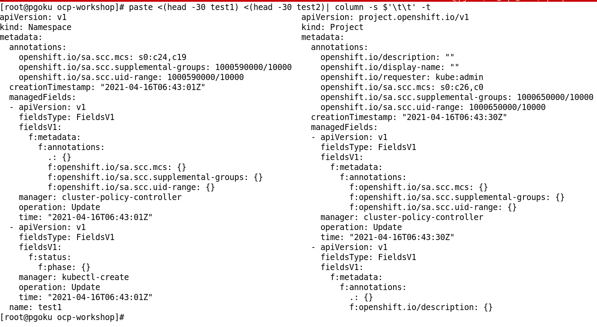
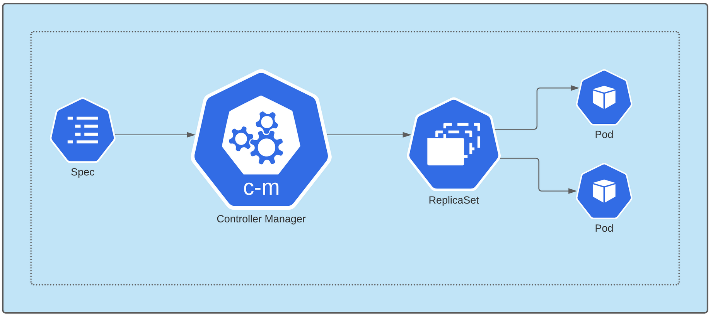
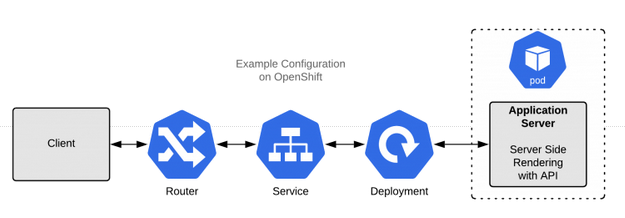
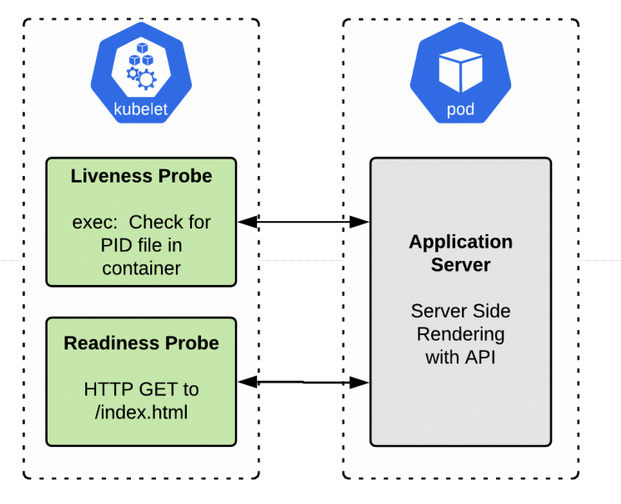
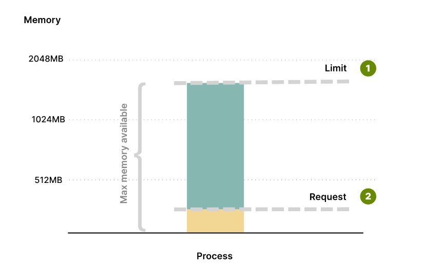
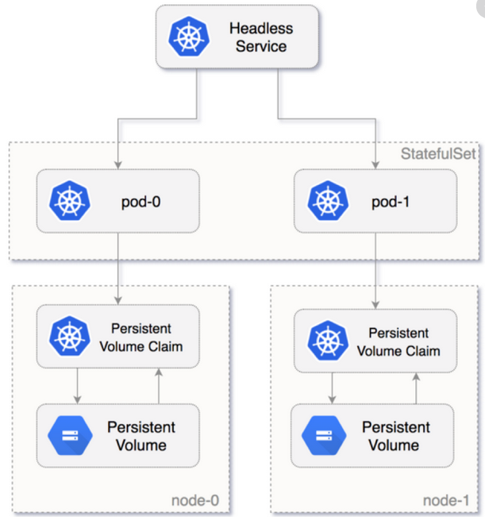
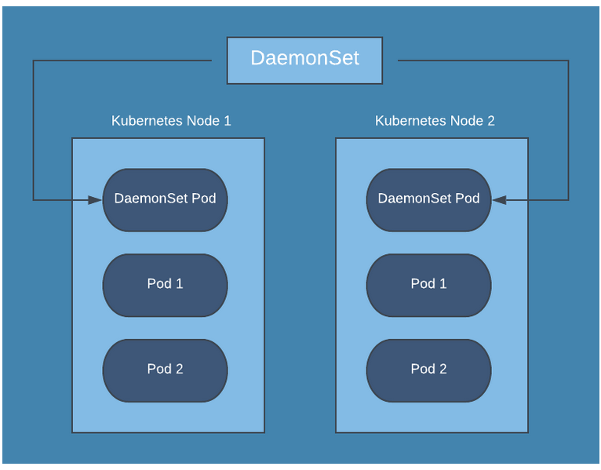
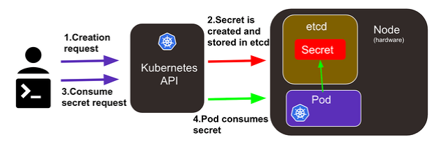
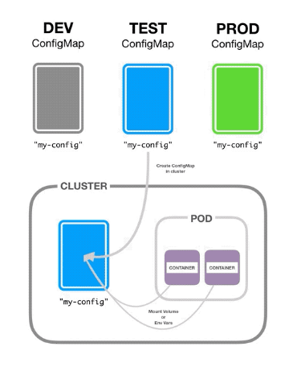

=== Projects vs Namespaces

OpenShift projects are nothing more than just Kubernetes namespaces with added features. A project is essentially the same as a namespace, but OpenShift provides additional administrative controls for projects. If you’re deploying software on OpenShift you’ll basically use the project exactly the same way as a Kubernetes namespace, except a normal user can be prevented from creating their own projects, requiring a cluster administrator to do that.

Projects provide for easier multi tenancy by:

* Having stricter validation than namespaces (i.e. you cannot annotate a project other than a handful of predefined keys meaning you can assert a privileged user or component set that data)

* Projects are actually indirectly created by the server by a request mechanism. Thus you do not need to give users the ability to create projects directly.

* A cluster admin can inject a template for project creation (so you can have a predefined way to set up projects across your cluster).

* The project list is a special endpoint that determines what projects you should be able to see. This is not possible to express via RBAC (i.e. list namespaces means you can see all namespaces).

.Projects vs Namespaces


=== Deployment

A __Deployment__ provides declarative updates for Pods and ReplicaSets.

You describe a desired state in a Deployment, and the Deployment Controller changes the actual state to the desired state at a controlled rate. You can define Deployments to create new ReplicaSets, or to remove existing Deployments and adopt all their resources with new Deployments.

Deployment is one of the mechanisms for handling workloads (applications) in Kubernetes. It is managed by Kubernetes Deployment Controller.

__In Kubernetes, controllers are control loops that watch the state of your cluster, then make or request changes where needed. Each controller tries to move the current cluster state closer to the desired state__.

.Deployments


If you create a deployment with name deployment, it will create a ReplicaSet with name **deployment<replica-set-id>**, which will further create a Pod with name **deployment-<replica-set->-<pod-id>**.

Deployments are usually used for **stateless** applications. However, you can save the state of deployment by attaching a Persistent Volume to it and make it stateful, but all the pods of a deployment will be sharing the same Volume and data across all of them will be same.

All right then, let's get started.


TIP: The command below has been generated with env variables which should match with you registry and images names, so you must set it before execute the oc apply.

```bash
$ EXTERNAL_REGISTRY=registry.docp4.lab.bcnconsulting.com:5000
$ HELLO_OCP_IMAGE=poc/hello-openshift:v1
```

In case of deployment below, the desired state we want to achieve is for the pods. Everything is declarative in K8s, so the desired state is written as a spec in Deployment manifest file.

```bash
$ cat << EOF |oc apply -f -
include::kubernetes-manifests-example/example-deploment.yml[] 
EOF
```

As we can see the Replicaset was created by our Deployment. 

TIP: It can be checked describing the replicaset or the pod at the line **"Controlled By:  Deployment/hello-openshift"**

```bash
$ oc get all
NAME                              READY   UP-TO-DATE   AVAILABLE   AGE
deployment.apps/hello-openshift   0/0     0            0           13s

NAME                                         DESIRED   CURRENT   READY   AGE
replicaset.apps/hello-openshift-85565cbfd5   0         0         0       13s
``` 

```bash
$ REPLICA_SET_OCP_HELLO=$(oc get rs -lapp=hello-openshift -o jsonpath='{range .items[*].metadata}{.name}{"\n"}{end}')
$  oc describe rs $REPLICA_SET_OCP_HELLO 
Name:           hello-openshift-777674f496
Namespace:      workshop-user1
Selector:       app=hello-openshift,deployment=hello-openshift,pod-template-hash=777674f496
Labels:         app=hello-openshift
                deployment=hello-openshift
                env=workshop
                pod-template-hash=777674f496
Annotations:    deployment.kubernetes.io/desired-replicas: 0
                deployment.kubernetes.io/max-replicas: 0
                deployment.kubernetes.io/revision: 1
Controlled By:  Deployment/hello-openshift
Replicas:       0 current / 0 desired
Pods Status:    0 Running / 0 Waiting / 0 Succeeded / 0 Failed
Pod Template:
  Labels:  app=hello-openshift
           deployment=hello-openshift
           env=workshop
           pod-template-hash=777674f496
  Containers:
   hello-openshift:
    Image:        registry.docp4.lab.bcnconsulting.com:5000/poc/hello-openshift:latest
    Port:         8080/TCP
    Host Port:    0/TCP
    Environment:  <none>
    Mounts:       <none>
  Volumes:        <none>
Events:           <none>                                                                 
```

Take into account that the replica is set to 0, to scale up the pod we must run the following.

```bash
$ oc scale deployment.apps/hello-openshift --replicas=3
```

We can check the events to know what happening... 

```bash
$ oc get events --sort-by={lastTimestamp}
3s          Normal    Scheduled                pod/hello-openshift-77bf85dbc4-75cdx    Successfully assigned workshop-user1/hello-openshift-77bf85dbc4-75cdx to dworker00
3s          Normal    Scheduled                pod/hello-openshift-77bf85dbc4-xwgxp    Successfully assigned workshop-user1/hello-openshift-77bf85dbc4-xwgxp to dworker01
3s          Normal    SuccessfulCreate         replicaset/hello-openshift-77bf85dbc4   Created pod: hello-openshift-77bf85dbc4-xwgxp
3s          Normal    SuccessfulCreate         replicaset/hello-openshift-77bf85dbc4   Created pod: hello-openshift-77bf85dbc4-75cdx
3s          Normal    SuccessfulCreate         replicaset/hello-openshift-77bf85dbc4   Created pod: hello-openshift-77bf85dbc4-mp92j
3s          Normal    Scheduled                pod/hello-openshift-77bf85dbc4-mp92j    Successfully assigned workshop-user1/hello-openshift-77bf85dbc4-mp92j to dworker00
3s          Normal    ScalingReplicaSet        deployment/hello-openshift              Scaled up replica set hello-openshift-77bf85dbc4 to 3
1s          Normal    AddedInterface           pod/hello-openshift-77bf85dbc4-xwgxp    Add eth0 [172.0.3.54/24]
1s          Normal    AddedInterface           pod/hello-openshift-77bf85dbc4-75cdx    Add eth0 [172.0.4.56/24]
0s          Normal    AddedInterface           pod/hello-openshift-77bf85dbc4-mp92j    Add eth0 [172.0.4.57/24]
0s          Normal    Pulling                  pod/hello-openshift-77bf85dbc4-xwgxp    Pulling image "registry.docp4.lab.bcnconsulting.com:5000/poc/hello-openshift:v1"
0s          Normal    Pulling                  pod/hello-openshift-77bf85dbc4-75cdx    Pulling image "registry.docp4.lab.bcnconsulting.com:5000/poc/hello-openshift:v1"
0s          Normal    Pulled                   pod/hello-openshift-77bf85dbc4-75cdx    Successfully pulled image "registry.docp4.lab.bcnconsulting.com:5000/poc/hello-openshift:v1" in 362.083007ms
0s          Normal    Pulled                   pod/hello-openshift-77bf85dbc4-xwgxp    Successfully pulled image "registry.docp4.lab.bcnconsulting.com:5000/poc/hello-openshift:v1" in 863.746353ms
0s          Normal    Pulled                   pod/hello-openshift-77bf85dbc4-mp92j    Container image "registry.docp4.lab.bcnconsulting.com:5000/poc/hello-openshift:v1" already present on machine
0s          Normal    Created                  pod/hello-openshift-77bf85dbc4-75cdx    Created container hello-openshift
0s          Normal    Started                  pod/hello-openshift-77bf85dbc4-75cdx    Started container hello-openshift
0s          Normal    Created                  pod/hello-openshift-77bf85dbc4-xwgxp    Created container hello-openshift
0s          Normal    Started                  pod/hello-openshift-77bf85dbc4-xwgxp    Started container hello-openshift
0s          Normal    Created                  pod/hello-openshift-77bf85dbc4-mp92j    Created container hello-openshift
0s          Normal    Started                  pod/hello-openshift-77bf85dbc4-mp92j    Started container hello-openshift
```

As we can see, the numbers of pods has been increased.

Now that we have significant number of pods on our cluster. Let’s try out the Deployment strategies.

==== Rolling Update Deployment 

Let’s say you were having some issues with v1 of your app and the v2 fixes it for you. You need to rollout a new update of your app image to your pod.

By updating the image of the current pods (state change), Kubernetes will rollout a new Deployment.

```bash
$ oc set image deployment.apps/hello-openshift hello-openshift=registry.docp4.lab.bcnconsulting.com:5000/ocp/hello-openshift:v2
```

After we set the new image, we can see the old pods getting terminated and new pods getting created.


We can see Kubernetes at work, making sure the pods are maintained properly. The last of the old pod doesn’t get terminated until the complete replicas for the new pods are created. The old pods also have a grace period which makes sure the traffic it is serving isn’t disconnected for certain time until the requests can be safely routed to the newly created pods.

We successfully updated all our pods to use our v2 app.

```bash
$ oc get deploy hello-openshift -ojson |jq -r '.spec.template.spec.containers[]|{image}'
{
  "image": "registry.docp4.lab.bcnconsulting.com:5000/poc/hello-openshift:v2"
}
```

==== Rollback Deployment 

Let’s assume the new version update has even more problems than the last one and now you realized how blissful life was with the old version. Time for a rollback to the previous version of our app.

But how do we do that? You might have noticed that there are now two ReplicaSets. It’s due to the same Deployment pattern we discussed earlier, we update our Deployment, it creates a new ReplicaSet which creates new Pods. Kubernetes holds history of up to 10 ReplicaSet by default, we can update that figure by using revisionHistoryLimit on our Deployment spec.

These history are tracked as rollouts. Only the latest rollout is active.

By now, we have made two changes to our Deployment hello-openshift so the rollout history should be two.

```bash
$ oc get rs
NAME                         DESIRED   CURRENT   READY   AGE
hello-openshift-544cbd695    3         3         3       11m
hello-openshift-77bf85dbc4   0         0         0       12m

$ oc rollout history deploy hello-openshift
deployment.apps/hello-openshift 
REVISION  CHANGE-CAUSE
1         <none>
2         <none>

$ oc rollout history deploy hello-openshift --revision=1
deployment.apps/hello-openshift with revision #1
Pod Template:
  Labels:	app=hello-openshift
	deployment=hello-openshift
	env=workshop
	pod-template-hash=77bf85dbc4
  Containers:
   hello-openshift:
    Image:	registry.docp4.lab.bcnconsulting.com:5000/poc/hello-openshift:v1
    Port:	8080/TCP
    Host Port:	0/TCP
    Environment:	<none>
    Mounts:	<none>
  Volumes:	<none

$ oc rollout history deploy hello-openshift --revision=2
deployment.apps/hello-openshift with revision #2
Pod Template:
  Labels:	app=hello-openshift
	deployment=hello-openshift
	env=workshop
	pod-template-hash=544cbd695
  Containers:
   hello-openshift:
    Image:	registry.docp4.lab.bcnconsulting.com:5000/poc/hello-openshift:v2
    Port:	8080/TCP
    Host Port:	0/TCP
    Environment:	<none>
    Mounts:	<none>
  Volumes:	<none>
```
Alright let’s get to rolling back our update to the previous rollout. We want to rollback to the stage where we were using V1 which is rollout Revision 1.

```bash
$ oc rollout undo deploy hello-openshift --to-revision=1
```

Like the Rolling Update Deployment, the Rollback Deployment terminates the current pods and replaces them with the pods containing the spec from Revision 1.

If you check the rollout history once again, you can see that the Revision 1 has been used to create the latest pods tagging it with Revision 3. There is no point in maintaining the same spec repeated for multiple revisions, so Kubernetes removes the Revision 1 since we have the latest Revision 3 of the same spec.


```bash
$ oc get rs
NAME                         DESIRED   CURRENT   READY   AGE
hello-openshift-544cbd695    3         3         3       11m
hello-openshift-77bf85dbc4   0         0         0       12m

$ oc rollout history deploy hello-openshift
deployment.apps/hello-openshift 
REVISION  CHANGE-CAUSE
1         <none>
2         <none>

$ oc rollout history deploy hello-openshift --revision=2
deployment.apps/hello-openshift with revision #2
Pod Template:
  Labels:	app=hello-openshift
	deployment=hello-openshift
	env=workshop
	pod-template-hash=77bf85dbc4
  Containers:
   hello-openshift:
    Image:	registry.docp4.lab.bcnconsulting.com:5000/ocp/hello-openshift:v2
    Port:	8080/TCP
    Host Port:	0/TCP
    Environment:	<none>
    Mounts:	<none>
  Volumes:	<none

$ oc rollout history deploy hello-openshift --revision=3
deployment.apps/hello-openshift with revision #3
Pod Template:
  Labels:	app=hello-openshift
	deployment=hello-openshift
	env=workshop
	pod-template-hash=544cbd695
  Containers:
   hello-openshift:
    Image:	registry.docp4.lab.bcnconsulting.com:5000/poc/hello-openshift:v1
    Port:	8080/TCP
    Host Port:	0/TCP
    Environment:	<none>
    Mounts:	<none>
  Volumes:	<none>
```

Now we are back on the app v1. with the Rollback Deployment. You can check that out by:

```bash
$ oc get deploy hello-openshift -ojson |jq -r '.spec.template.spec.containers[]|{image}'
{
  "image": "registry.docp4.lab.bcnconsulting.com:5000/poc/hello-openshift:v1"
}
```

As we've seen, if any of our pod instances should fail or update(a status change), the Kubernetes system responds to the difference between manifest spec and status by making a correction, i.e. matching the state of Deployment as defined on the spec.

==== Rolling Update recorded change

The rollout history change cause is handle by the metadata annotation "**kubernetes.io/change-cause**". There are two ways to add this annotation to our delpoyment:

1. Through the flag --record=true.

With this approach, the command oc will add the exact command line that has been executed to the annotation.  The recorded change is useful for future introspection, for example, to see the commands executed in each Deployment revision.

Let's try it in the terminal.

```bash
# Export variables
EXTERNAL_REGISTRY=registry.docp4.lab.bcnconsulting.com:5000
HELLO_OCP_IMAGE_V2=poc/hello-openshift:v2
```

```bash
# set new image with the --record flag set to true.
$ oc set image deployment.apps/hello-openshift hello-openshift=$EXTERNAL_REGISTRY/$HELLO_OCP_IMAGE_V2 --record=true
```

Now we can check that the annotation has been added and it can be visible into the rollout history.

```bash
$ oc rollout history deploy hello-openshift
deployment.apps/hello-openshift 
REVISION  CHANGE-CAUSE
3         <none>
5         <none>
6         <none>
7         <none>
10        oc set image deployment.apps/hello-openshift hello-openshift=axdesregistry1.central.inditex.grp/poc/hello-openshift:v1 --record=true
11        oc set image deployment.apps/hello-openshift hello-openshift=axdesregistry1.central.inditex.grp/ocp/hello-openshift:v2 --record=true
12        oc set image deployment.apps/hello-openshift hello-openshift=axdesregistry1.central.inditex.grp/poc/hello-openshift:v2 --record=true
```

2. Modifying directly the annotation "**kubernetes.io/change-cause**" in the manifest

```bash
$ oc annotate deployment.apps/hello-openshift kubernetes.io/change-cause="Change Image Version"
$ oc set image deployment.apps/hello-openshift hello-openshift=$EXTERNAL_REGISTRY/$HELLO_OCP_IMAGE_V2
$ oc rollout history deploy hello-openshift  
deployment.apps/hello-openshift 
REVISION  CHANGE-CAUSE
3         <none>
5         <none>
6         <none>
7         <none>
10        oc set image deployment.apps/hello-openshift hello-openshift=axdesregistry1.central.inditex.grp/poc/hello-openshift:v1 --record=true
11        oc set image deployment.apps/hello-openshift hello-openshift=axdesregistry1.central.inditex.grp/ocp/hello-openshift:v2 --record=true
12        Change Image Version
```

==== Liveness and readiness probes

Liveness and readiness are the two main probe types available in OpenShift. They have similar configuration APIs but different meanings to the platform.

When a liveness probe fails, it signals to OpenShift that the probed container is dead and should be restarted. When a readiness probe fails, it indicates to OpenShift that the container being probed is not ready to receive incoming network traffic. The application might become ready in the future, but it should not receive traffic now.

If the liveness probe succeeds while the readiness probe fails, OpenShift knows that the container is not ready to receive network traffic but is working to become ready. For example, this is common in applications that take time to initialize or to handle long-running calls synchronously. (Handling long-running calls synchronously is an anti-pattern, but unfortunately, we are stuck with it in some legacy applications.)


==== What are liveness probes for?

A liveness probe sends a signal to OpenShift that the container is either alive (passing) or dead (failing). If the container is alive, then OpenShift does nothing because the current state is good. If the container is dead, then OpenShift attempts to heal the application by restarting it.

The name liveness probe expresses a semantic meaning. In effect, the probe answers the true-or-false question: “Is this container alive?”


==== What if I don’t specify a liveness probe?

If you don’t specify a liveness probe, then OpenShift will decide whether to restart your container based on the status of the container’s PID 1 process. The PID 1 process is the parent process of all other processes that run inside the container. Because each container begins life with its own process namespace, the first process in the container will assume the special duties of PID 1.

If the PID 1 process exits and no liveness probe is defined, OpenShift assumes (usually safely) that the container has died. Restarting the process is the only application-agnostic, universally effective corrective action. As long as PID 1 is alive, regardless of whether any child processes are running, OpenShift will leave the container running.

If your application is a single process, and that process is PID 1, then this default behavior might be precisely what you want—meaning that you don’t need a liveness probe. If you are using an init tool such as tini or dumb-init, then it might not be what you want. The decision of whether to define your own liveness probe instead of using the default behavior is specific to each application

==== What are readiness probes for?

OpenShift services use readiness probes to know whether the container being probed is ready to start receiving network traffic. If your container enters a state where it is still alive but cannot handle incoming network traffic (a common scenario during startup), you want the readiness probe to fail. That way, OpenShift will not send network traffic to a container that isn’t ready for it. If OpenShift did prematurely send network traffic to the container, it could cause the load balancer (or router) to return a 502 error to the client and terminate the request; either that or the client would get a “connection refused” error message.

Like the liveness probe, the name of the readiness probe conveys a semantic meaning. In effect, this probe answers the true-or-false question: “Is this container ready to receive network traffic?”


==== What if I don’t specify a readiness probe?

If you don’t specify a readiness probe, OpenShift will assume that the container is ready to receive traffic as soon as PID 1 has started. This is never what you want.

Assuming readiness without checking for it will cause errors (such as 502s from the OpenShift router) anytime a new container starts up, such as on scaling events or deployments. Without a readiness probe, you will get bursts of errors every time you deploy, as the old containers terminate and the new ones start up. If you are using autoscaling, then depending on the metric threshold you set, new instances could be started and stopped at any time, especially during times of fluctuating load. As the application scales up or down, you will get bursts of errors, as containers that are not quite ready to receive network traffic are included in the load-balancer distribution.

You can easily fix these problems by specifying a readiness probe. The probe gives OpenShift a way to ask your container if it is ready to receive traffic.

Note: The fact that there are different types of probes with identical APIs is a frequent source of confusion. But the existence of two or more probe types is good design: It makes OpenShift flexible for various application types. The availability of both liveness and readiness probes is critical to OpenShift’s reputation for being a Container-as-a-Service that accommodates a wide range of applications.


==== Real Scenario example: A server-side rendered application with an API

.The SSR application without any probes configured.


This example is a standard server-side rendered (SSR) application: It renders HTML pages on the server, on-demand, and sends them to the client. We could build an application like this using Spring Boot, PHP, Ruby on Rails, Django, Node.js, or any similar framework.

===== Do we need a liveness probe?

If the application starts up in a few seconds or less, then a liveness probe is probably unnecessary. If it takes more than a few seconds, we should put in a liveness probe to ensure that the container initializes without error rather than crashing. 

In this case, we could use an exec type of liveness probe, which runs a shell command to ensure that things are still running. This command will vary depending on the application. For example, if the app writes a PID file, we could check that it is still alive:

```bash
        livenessProbe:
          exec:
            command:
            - /bin/sh
            - -c
            - "[ -f /run/my-application-web.pid ] && ps -A | grep my-application-web"
          initialDelaySeconds: 10
          periodSeconds: 5
```
===== Do we need a readiness probe?

Because this application handles incoming network requests, we will definitely want a readiness probe. Without a readiness probe, OpenShift will immediately send network traffic to our container after starting it, whether the application is ready or not. If the container starts dropping requests but hasn’t crashed, it will continue to receive traffic indefinitely, which is certainly not what we want.

We want OpenShift to remove the container from the load balancer if it ceases to return healthy responses. We can use a readiness probe like this one to signal to OpenShift that the container is ready to receive network traffic:

```bash
        readinessProbe:
          httpGet:
            scheme: HTTPS
            path: /healthz
            port: 8443
          initialDelaySeconds: 10
          periodSeconds: 5
```
Figure below shows a diagram of the SSR application with both liveness and readiness probes configured.

.The SSR application with probes configured.


==== Probe Example

Let's add a rediness __httpGet__ probe to our hello-openshift app to check the port 8081.

```bash
$ oc set probe deploy/hello-openshift --readiness --get-url=http://:8081

$ oc get deploy/hello-openshift -oyaml
...
    spec:
      containers:
      - image: registry.docp4.lab.bcnconsulting.com:5000/poc/hello-openshift:v2
        imagePullPolicy: IfNotPresent
        name: hello-openshift
        ports:
        - containerPort: 8080
          protocol: TCP
        readinessProbe:
          failureThreshold: 3
          httpGet:
            path: /
            port: 8081
            scheme: HTTP
          periodSeconds: 10
          successThreshold: 1
          timeoutSeconds: 1
        resources: {}
...
```
Hey wait, did I say port 8081?. As we can see when we describe the deployment, the container port is pointing to the port 8080. Let's check the events:

```bash
$ oc get events --sort-by={lastTimestamp}
2m24s       Normal    Created                  pod/hello-openshift-6d44b7c8f8-lggdm    Created container hello-openshift
2m24s       Normal    AddedInterface           pod/hello-openshift-6d44b7c8f8-lggdm    Add eth0 [172.0.4.86/24]
2m17s       Normal    ScalingReplicaSet        deployment/hello-openshift              Scaled down replica set hello-openshift-9454897c9 to 0
2m17s       Normal    Killing                  pod/hello-openshift-9454897c9-dgl7z     Stopping container hello-openshift
2m17s       Normal    SuccessfulDelete         replicaset/hello-openshift-9454897c9    Deleted pod: hello-openshift-9454897c9-dgl7z
2m15s       Warning   Unhealthy   
``` 

There you go!, ourrediness probe has failed, even though our app is running, because the probe is checking the wrong port.

If you want to go deeper, the most of the information about this examples could be found at https://developers.redhat.com/blog/2020/11/10/you-probably-need-liveness-and-readiness-probes/[You (probably) need liveness and readiness probes] or https://docs.openshift.com/container-platform/4.7/applications/application-health.html[documentation].

=== Quota and Limits

Resource quotas provide constraints that limit resource consumption per namespace. They can be applied only at the namespace level, which means they can be applied to computing resources and limit the number of objects inside the namespace.

A Kubernetes resource quota is defined by a ResourceQuota object. When applied to a namespace, it can limit computing resources such as CPU and memory as well as the creation of the following objects:

1. Pods
2. Services
3. Secrets
4. Persistent Volume Claims (PVCs)
5. ConfigMaps

Kubernetes supports two types of CPU and memory quotas to manage compute resources. These are controlled via limits and requests, as the LimitRange documentation explains.

**Requests** define the minimum amount of resources that containers need. If you think that your app requires at least 256MB of memory to operate, this is the request value.

The application can use more than 256MB, but Kubernetes guarantees a minimum of 256MB to the container.

On the other hand, **limits** define the max amount of resources that the container can consume. Your application might require at least 256MB of memory, but you might want to be sure that it doesn't consume more than 1GB of memory.

That's your limit.

Notice how your application has 256MB of memory guaranteed, but it can grow up until 1GB of memory.

After that, it is stopped or throttled by Kubernetes.

.Limits.



IMPORTANT: Setting limits is useful to stop over-committing resources and protect other deployments from resource starvation.

You might want to prevent a single rogue app from using all resources available and leaving only breadcrumbs to the rest of the cluster.

__If limits are used to stop your greedy containers, what are requests for?__

Requests affect how the pods are scheduled in Kubernetes. When a Pod is created, the scheduler finds the nodes which can accommodate the Pod.

__But how does it know how much CPU and memory is needed?__

The app hasn't started yet, and the scheduler can't inspect memory and CPU usage at this point.

This is where requests come in.

The scheduler reads the requests for each container in your Pods, aggregates them and finds the best node that can fit that Pod.

Some applications might use more memory than CPU. Others the opposite.

It doesn't matter, Kubernetes checks the requests and finds the best Node for that Pod.


A typical Pod spec for resources might look something like this. This pod has two containers:

```bash
       containers:
        - name: container-one
          image: quay.io/openshift-release-dev/ocp-v4
          imagePullPolicy: IfNotPresent
          command: [ "python3", "-m", "http.server", "8080" ]
          ports:
            - name: http
              containerPort: 8080
          resources:
            limits:
              cpu: "750m"
              memory: 768Mi
            requests:
              cpu: "500m"
              memory: 512Mi
        - name: container-two
          image: quay.io/openshift-release-dev/ocp-v4
          imagePullPolicy: IfNotPresent
          command: [ "python3", "-m", "http.server", "9090" ]
          ports:
            - name: http
              containerPort: 8080
          resources:
            limits:
              cpu: "500m"
              memory: 512Mi
            requests:
              cpu: "500m"
              memory: 512Mi              

```

As we can see here, **Requests** define the minimum amount of resources that containers need, and **limits** define the max amount of resources that the container can consume.

=== StatefulSets

StatefulSet is a Kubernetes resource used to manage stateful applications. It manages the deployment and scaling of a set of Pods, and provides guarantee about the ordering and uniqueness of these Pods.

StatefulSet is also a Controller but unlike Deployments, it doesn’t create ReplicaSet rather itself creates the Pod with a unique naming convention. e.g. If you create a StatefulSet with name counter, it will create a pod with name counter-0, and for multiple replicas of a statefulset, their names will increment like counter-0, counter-1, counter-2, etc

Every replica of a stateful set will have its own state, and each of the pods will be creating its own PVC(Persistent Volume Claim). So a statefulset with 3 replicas will create 3 pods, each having its own Volume, so total 3 PVCs.

.Statefulsets


For learning purpuse will be deploying a postgres database using a statefulset, we will be using the following manifest. 

TIP: The command below has been generated with env variables which should match with you registry and images names, so you must set it before execute the oc apply.

```bash
$ EXTERNAL_REGISTRY=registry.docp4.lab.bcnconsulting.com:5000
$ POSTGRES_IMAGE=poc/postgresql-10:latest
$ POSTGRES_STORAGE_CLASS_NAME=ocs-external-storagecluster-cephfs
```

```bash
$ cat << EOF |oc apply -f -
include::kubernetes-manifests-example/example-statefulset.yml[] 
EOF
```

```bash
$ oc get all --show-labels                                                                                                  
NAME                READY   STATUS    RESTARTS   AGE   LABELS
pod/sts-example-0   1/1     Running   0          55s   app=workshop-sts-example,controller-revision-hash=sts-example-649fd7cfd6,env=workshop,statefulset.kubernetes.io/pod-name=sts-example-0

NAME                           READY   AGE   LABELS
statefulset.apps/sts-example   1/1     56s   app=workshop-sts-example,env=workshop

$ oc get pvc
NAME                             STATUS   VOLUME                                     CAPACITY   ACCESS MODES   STORAGECLASS                         AGE
sts-example-data-sts-example-0   Bound    pvc-ab2284f5-4069-47ae-94a9-5e2adbd43fe4   250Mi      RWX            ocs-external-storagecluster-cephfs   60s
```

Now if we scale up the statefulset to 3 replicas by run

```bash
$ oc scale statefulset.apps/sts-example --replicas=3
```

It will first create a new pod sts-example-data-sts-example-1, and once that pod is ready, then another pod sts-example-data-sts-example-2. The new pods will have their own Volume.


```bash
$ oc get pvc                                                                                                        NAME                             STATUS   VOLUME                                     CAPACITY   ACCESS MODES   STORAGECLASS                         AGE
sts-example-data-sts-example-0   Bound    pvc-ab2284f5-4069-47ae-94a9-5e2adbd43fe4   250Mi      RWX            ocs-external-storagecluster-cephfs   117s
sts-example-data-sts-example-1   Bound    pvc-42c8a240-fcf1-42e6-83dd-eda4641de797   250Mi      RWX            ocs-external-storagecluster-cephfs   25s
sts-example-data-sts-example-2   Bound    pvc-e3e3ae1b-31b0-476a-9608-840e2dfc9575   250Mi      RWX            ocs-external-storagecluster-cephfs   12s

oc get all --show-labels 
NAME                READY   STATUS    RESTARTS   AGE     LABELS
pod/sts-example-0   1/1     Running   0          2m13s   app=workshop-sts-example,controller-revision-hash=sts-example-649fd7cfd6,env=workshop,statefulset.kubernetes.io/pod-name=sts-example-0
pod/sts-example-1   1/1     Running   0          41s     app=workshop-sts-example,controller-revision-hash=sts-example-649fd7cfd6,env=workshop,statefulset.kubernetes.io/pod-name=sts-example-1
pod/sts-example-2   1/1     Running   0          28s     app=workshop-sts-example,controller-revision-hash=sts-example-649fd7cfd6,env=workshop,statefulset.kubernetes.io/pod-name=sts-example-2

NAME                           READY   AGE     LABELS
statefulset.apps/sts-example   3/3     2m13s   app=workshop-sts-example,env=workshop
```

StatefulSets don’t create ReplicaSet or anything of that sort, so you can't rollback a StatefulSet to a previous version. 

You can only delete or scale up/down the Statefulset. If you update a StatefulSet, it also performs RollingUpdate i.e. one replica pod will go down and the updated pod will come up, then the next replica pod will go down in same manner e.g. 

If I change the image of the above StatefulSet, the sts-example-data-sts-example-2 will terminate and once it terminates completely, then sts-example-data-sts-example-2 will be recreated and sts-example-data-sts-example-1 will be terminated at the same time, similarly for next replica i.e. sts-example-data-sts-example-0. 

If an error occurs while updating, so only sts-example-data-sts-example-2 will be down, sts-example-data-sts-example-1 & sts-example-data-sts-example-0 will still be up, running on previous stable version. 

Unlike Deployments, you cannot roll back to any previous version of a StatefulSet.

=== DaemonSet

A DaemonSet is a controller that ensures that the pod runs on all the nodes of the cluster. If a node is added/removed from a cluster, DaemonSet automatically adds/deletes the pod.

Some typical use cases of a DaemonSet is to run cluster level applications like:

    Monitoring Exporters: You would want to monitor all the nodes of your cluster so you will need to run a monitor on all the nodes of the cluster like NodeExporter.

    Logs Collection Daemon: You would want to export logs from all nodes so you would need a DaemonSet of log collector like Fluentd to export logs from all your nodes.

However, Daemonset automatically doesn’t run on nodes which have a taint e.g. Master. You will have to specify the tolerations for it on the pod.


.Daemonsets


Let's check the node-exporters from the monitoring stack of our cluster.

```bash
$ oc get ds -n openshift-monitoring
NAME            DESIRED   CURRENT   READY   UP-TO-DATE   AVAILABLE   NODE SELECTOR            AGE
node-exporter   5         5         5       5            5           kubernetes.io/os=linux   23d

$ oc get nodes
NAME        STATUS   ROLES    AGE   VERSION
dmaster00   Ready    master   23d   v1.19.0+7070803
dmaster01   Ready    master   23d   v1.19.0+7070803
dmaster02   Ready    master   23d   v1.19.0+7070803
dworker00   Ready    worker   22d   v1.19.0+7070803
dworker01   Ready    worker   22d   v1.19.0+7070803

$ oc get pods -lapp.kubernetes.io/name=node-exporter -owide -n openshift-monitoring
NAME                  READY   STATUS    RESTARTS   AGE   IP             NODE        NOMINATED NODE   READINESS GATES
node-exporter-dp8df   2/2     Running   0          23d   10.0.113.11    dmaster00   <none>           <none>
node-exporter-h69hm   2/2     Running   0          22d   10.0.113.102   dworker01   <none>           <none>
node-exporter-jlsww   2/2     Running   0          23d   10.0.113.13    dmaster02   <none>           <none>
node-exporter-svwqn   2/2     Running   0          23d   10.0.113.12    dmaster01   <none>           <none>
node-exporter-v2dzv   2/2     Running   0          22d   10.0.113.101   dworker00   <none>           <none>
```

=== jobs

As the https://kubernetes.io/docs/concepts/workloads/controllers/job/[Kubernetes documentation] explains, a Kubernetes Job creates one or more pods and ensures that a specified number of the pods terminates when the task (Job) completes.

Just like in a typical operating system, the ability to perform automated, scheduled jobs without user interaction is important in the Kubernetes world. 


Kubernetes Jobs are used to create transient pods that perform specific tasks they are assigned to. CronJobs do the same thing, but they run tasks based on a defined schedule.

Jobs play an important role in Kubernetes, especially for running batch processes or important ad-hoc operations. Jobs differ from other Kubernetes controllers in that they run tasks until completion, rather than managing the desired state such as in Deployments, ReplicaSets, and StatefulSets.

TIP: The command below has been generated with env variables which should match with you registry and images names, so you must set it before execute the oc apply.

```bash
$ EXTERNAL_REGISTRY=registry.docp4.lab.bcnconsulting.com:5000
$ PEARL_JOB_IMAGE=poc/perl:latest
```

Here is an example from https://kubernetes.io/docs/concepts/workloads/controllers/job/[kubernetes docs]. It computes π to 2000 places and prints it out. It takes around 10s to complete.

```bash
$ cat << EOF |oc apply -f -
include::kubernetes-manifests-example/example-job.yml[] 
EOF
```

After creating the job, get its status using this command:

```bash
oc describe jobs/pi
Name:           pi
Namespace:      workshop-silviop
Selector:       controller-uid=00fd4cb8-dc62-40f1-8c3c-40d85616ce04
Labels:         controller-uid=00fd4cb8-dc62-40f1-8c3c-40d85616ce04
                job-name=pi
Annotations:    <none>
Parallelism:    1
Completions:    1
Start Time:     Mon, 19 Apr 2021 10:45:51 +0200
Pods Statuses:  1 Running / 0 Succeeded / 0 Failed
Pod Template:
  Labels:  controller-uid=00fd4cb8-dc62-40f1-8c3c-40d85616ce04
           job-name=pi
  Containers:
   pi:
    Image:      perl
    Port:       <none>
    Host Port:  <none>
    Command:
      perl
      -Mbignum=bpi
      -wle
      print bpi(2000)
    Environment:  <none>
    Mounts:       <none>
  Volumes:        <none>
Events:
  Type    Reason            Age   From            Message
  ----    ------            ----  ----            -------
  Normal  SuccessfulCreate  21s   job-controller  Created pod: pi-f7kpn
```

To view completed Pods of a Job, use oc get pods.

To list all the Pods that belong to a Job in a machine readable form, you can use a command like this:

```bash
$ PI_POD=$(kubectl get pods --selector=job-name=pi --output=jsonpath='{.items[*].metadata.name}')

$ echo $PI_POD
pi-f7kpn
```

Here, the selector is the same as the selector for the Job. The --output=jsonpath option specifies an expression with the name from each Pod in the returned list.

View the standard output of one of the pods:

```bash
$ oc logs pi-f7kpn -f
3.1415926535897932384626433832795028841971693993751058209749445923078164062862089986280348253421170679821480865132823066470938446095505822317253594081284811174502841027019385211055596446229489549303819644288109756659334461284756482337867831652712019091456485669234603486104543266482133936072602491412737245870066063155881748815209209628292540917153643678925903600113305305488204665213841469519415116094330572703657595919530921861173819326117931051185480744623799627495673518857527248912279381830119491298336733624406566430860213949463952247371907021798609437027705392171762931767523846748184676694051320005681271452635608277857713427577896091736371787214684409012249534301465495853710507922796892589235420199561121290219608640344181598136297747713099605187072113499999983729780499510597317328160963185950244594553469083026425223082533446850352619311881710100031378387528865875332083814206171776691473035982534904287554687311595628638823537875937519577818577805321712268066130019278766111959092164201989380952572010654858632788659361533818279682303019520353018529689957736225994138912497217752834791315155748572424541506959508295331168617278558890750983817546374649393192550604009277016711390098488240128583616035637076601047101819429555961989467678374494482553797747268471040475346462080466842590694912933136770289891521047521620569660240580381501935112533824300355876402474964732639141992726042699227967823547816360093417216412199245863150302861829745557067498385054945885869269956909272107975093029553211653449872027559602364806654991198818347977535663698074265425278625518184175746728909777727938000816470600161452491921732172147723501414419735685481613611573525521334757418494684385233239073941433345477624168625189835694855620992192221842725502542568876717904946016534668049886272327917860857843838279679766814541009538837863609506800642251252051173929848960841284886269456042419652850222106611863067442786220391949450471237137869609563643719172874677646575739624138908658326459958133904780275901
```

=== Cronjobs

You can use CronJobs for cluster tasks that need to be executed on a predefined schedule. As the https://kubernetes.io/docs/tasks/job/automated-tasks-with-cron-jobs/[documentation] explains, they are useful for periodic and recurring tasks, like running backups, sending emails, or scheduling individual tasks for a specific time, such as when your cluster is likely to be idle.

TIP: The command below has been generated with env variables which should match with you registry and images names, so you must set it before execute the oc apply.

```bash
$ EXTERNAL_REGISTRY=registry.docp4.lab.bcnconsulting.com:5000
$ BUSYBOX_CRONJOB_IMAGE=poc/busybox:latest
```

Cron jobs require a config file. This example cron job config .spec file prints the current time and a hello message every minute:

```bash
$ cat << EOF |oc apply -f -
include::kubernetes-manifests-example/example-cronjob.yml[] 
EOF
```

==== Cron schedule syntax 
```bash
# ┌───────────── minute (0 - 59)
# │ ┌───────────── hour (0 - 23)
# │ │ ┌───────────── day of the month (1 - 31)
# │ │ │ ┌───────────── month (1 - 12)
# │ │ │ │ ┌───────────── day of the week (0 - 6) (Sunday to Saturday;
# │ │ │ │ │                                   7 is also Sunday on some systems)
# │ │ │ │ │
# │ │ │ │ │
# * * * * *
```

 
.Crontab description
[cols=3*,cols="1,2,5",options="header"]
|===
| Entry
| Description
| Equivalent to

|@yearly (or @annually)
|Run once a year at midnight of 1 January
|0 0 1 1 *

|@monthly
|Run once a month at midnight of the first day of the month
|0 0 1 * *

|@weekly
|Run once a week at midnight on Sunday morning
|0 0 * * 0

|@daily (or @midnight)
|Run once a day at midnight
|0 0 * * *

|@hourly
|Run once an hour at the beginning of the hour
|0 * * * *

|===

For example, the line below states that the task must be started every Friday at midnight, as well as on the 13th of each month at midnight:

0 0 13 * 5


After creating the cron job, get its status using this command:

```bash
$  oc get cronjob hello
NAME    SCHEDULE      SUSPEND   ACTIVE   LAST SCHEDULE   AGE
hello   */1 * * * *   False     0        57s             5m5s
```

The output is similar to this:

```bash
$ oc get jobs --watch
NAME               COMPLETIONS   DURATION   AGE
hello-1618822860   1/1           8s         3m2s
hello-1618822920   1/1           7s         2m1s
hello-1618822980   1/1           6s         61s
hello-1618823040   0/1           1s         1s
```


You should see that the cron job hello successfully scheduled a job at the time specified in LAST SCHEDULE. There are currently 0 active jobs, meaning that the job has completed or failed.

Now, find the pods that the last scheduled job created and view the standard output of one of the pods.

```bash
$ CRON_POD=$(oc get pods -o jsonpath='{range .items[*].metadata}{.name}{"\n"}{end}'|head -1)

$ oc logs $CRON_POD
Mon Apr 19 09:06:14 UTC 2021
Hello from the Kubernetes cluster
```
==== Deleting a Cron Job

When you don't need a cron job any more, delete it with oc delete cronjob <cronjob name>:

```bash
$ oc delete cronjob hello
cronjob.batch "hello" deleted
```

Deleting the cron job removes all the jobs and pods it created and stops it from creating additional jobs. You can read more about removing jobs in garbage collection.


=== Configuration management (ConfigMap + Secret)

==== Secrets

Kubernetes Secrets let you store and manage sensitive information, such as passwords, OAuth tokens, and ssh keys. Storing confidential information in a Secret is safer and more flexible than putting it verbatim in a Pod definition or in a container image. See Secrets design document for more information.

A Secret is an object that contains a small amount of sensitive data such as a password, a token, or a key. Such information might otherwise be put in a Pod specification or in an image. Users can create Secrets and the system also creates some Secrets.

To use a Secret, a Pod needs to reference the Secret. A Secret can be used with a Pod in three ways:

1. As files in a volume mounted on one or more of its containers.
2. As container environment variable.
3. By the kubelet when pulling images for the Pod.


.SecretsFlow



===== Create a Secret manually

To create the Secret containing the POSTGRESQL_PASSWORD, choose a password and convert it to base64:

```bash
# The postgres password will be "postgres"
$ echo -n 'postgres' | base64
cG9zdGdyZXM=
```

It should noted the encoded string. You need it to create the secret from a YAML file definition:

```bash
$ cat << EOF |oc apply -f -
include::kubernetes-manifests-example/example-secret.yml[] 
EOF
```

Now that you've created the Secret, use oc describe to see it:

```bash
$ oc describe secret postgres-password
Name:         postgres-password
Namespace:    workshop-silviop
Labels:       <none>
Annotations:  <none>

Type:  Opaque

Data
====
password:  8 bytes
```

Note that the Data field contains the key you set in the YAML: password. The value assigned to that key is the password you created, but it is not shown in the output. Instead, the value's size is shown in its place, in this case, 8 bytes.

Again, the data field with the password key is visible, and this time you can see the base64-encoded Secret.

Another way to create the secret is just running the following:

```bash
$ oc create secret generic my-secret-workshop --from-literal=key1=supersecret
```

This way you don need to encoded the secret, the kubernets will do it for you.

==== Decode the Secret

Let's say you need to view the Secret in plain text, for example, to verify that the Secret was created with the correct content. You can do this by decoding it.

It is easy to decode the Secret by extracting the value and piping it to base64. In this case, you will use the output format -o jsonpath=<path> to extract only the Secret value using a JSONPath template.

```bash
$ oc get secret postgres-password -o jsonpath='{.data.password}' | base64 -d
postgres
```

==== Enable your pod to use a secrets

Now that you have created a secret you can use it in your pod by mounting it as a volume or setting an environment variable. 

```bash
$ cat << EOF |oc apply -f -
include::kubernetes-manifests-example/example-pod-secret.yml[] 
EOF
```

Delete the pod and the secret.

```bash
$ oc delete pod -lapp=workshop-pod-secret-example;oc delete secret postgres-password
```

==== What is a ConfigMap in Kubernetes?

A ConfigMap is a dictionary of configuration settings. This dictionary consists of key-value pairs of strings. Kubernetes provides these values to your containers. Like with other dictionaries (maps, hashes, ...) the key lets you get and set the configuration value.

.configMaps



==== How to Create a ConfigMap?

You can create ConfigMaps from files, directories, and literal values.

The basic syntax for creating a ConfigMap is:

```bash
$ oc create configmap [configmap_name] [attribute] [source]
```

Depending on the source, the attribute will be:

* __--from file (if the source is a file/directory)__
* __--from-literal (if the source is a key-value pair)__


Let's create a configmap to see how this works:


```bash
$ cat << EOF |oc apply -f -
include::kubernetes-manifests-example/example-configmap.yml[] 
EOF
```

$ oc get cm
NAME                         DATA   AGE
example-configmap-postgres   3      3s

Now it's created let's reference the configmap in the pod's definition.

TIP: The command below has been generated with env variables which should match with you registry and images names, so you must set it before execute the oc apply.

```bash
$ EXTERNAL_REGISTRY=registry.docp4.lab.bcnconsulting.com:5000
$ POSTGRES_IMAGE=poc/postgresql-10:latest
$ POSTGRES_STORAGE_CLASS_NAME=ocs-external-storagecluster-ceph-rbd
```


```bash
$ cat << EOF |oc apply -f -
include::kubernetes-manifests-example/example-pod-configmap.yml[] 
EOF
```

Try to connect:

```bash
$ oc get events --sort-by={lastTimestamp}  -w

$ POD_DB=$(oc get pods -lapp=workshop-pod-configmap-example -o jsonpath='{range .items[*].metadata}{.name}{"\n"}{end}')

$ oc exec $POD_DB -- env| grep POSTGRES
POSTGRESQL_DATABASE=gogs
POSTGRESQL_PASSWORD=gogs
POSTGRESQL_USER=gogs
POSTGRESQL_VERSION=10
POSTGRESQL_PREV_VERSION=9.6
```

Delete the pod and the configmap.

```bash
$ oc delete pod -lapp=workshop-pod-configmap-example;oc delete cm -lapp=workshop-pod-configmap-example
```

=== Services

Kubernetes gives Pods their own IP addresses and a single DNS name for a set of Pods, and can load-balance across them.

**Why**?

Kubernetes Pods are created and destroyed to match the state of your cluster. Pods are nonpermanent resources. If you use a Deployment to run your app, it can create and destroy Pods dynamically.

Each Pod gets its own IP address, however in a Deployment, the set of Pods running in one moment in time could be different from the set of Pods running that application a moment later.

This leads to a problem: if some set of Pods (call them "backends") provides functionality to other Pods (call them "frontends") inside your cluster, how do the frontends find out and keep track of which IP address to connect to, so that the frontend can use the backend part of the workload?

==== Service resources

In Kubernetes, a Service is an abstraction which defines a logical set of Pods and a policy by which to access them (sometimes this pattern is called a micro-service). The set of Pods targeted by a Service is usually determined by a selector. To learn about other ways to define Service endpoints, see Services without selectors.

For example, consider a stateless image-processing backend which is running with 3 replicas. Those replicas are fungible—frontends do not care which backend they use. While the actual Pods that compose the backend set may change, the frontend clients should not need to be aware of that, nor should they need to keep track of the set of backends themselves.

==== What does ClusterIP, NodePort, and LoadBalancer mean?

The type property in the Service's spec determines how the service is exposed to the network. It changes where a Service is able to be accessed from. The possible types are ClusterIP, NodePort, and LoadBalancer

  * **ClusterIP** – The default value. The service is only accessible from within the Kubernetes cluster – you can’t make requests to your Pods from outside the cluster!
  * **NodePort** – This makes the service accessible on a static port on each Node in the cluster. This means that the service can handle requests that originate from outside the cluster.
  * **LoadBalancer** – The service becomes accessible externally through a cloud provider's load balancer functionality. GCP, AWS, Azure, and OpenStack offer this functionality. The cloud provider will create a load balancer, which then automatically routes requests to your Kubernetes Service


Let's reuse the deployment example to create a pod and access to it through a service. 

```bash
$ EXTERNAL_REGISTRY=registry.docp4.lab.bcnconsulting.com:5000
$ HELLO_OCP_IMAGE=ocp/hello-openshift:v1
```

```bash
$ cat << EOF |oc apply -f -
include::kubernetes-manifests-example/example-deploment.yml[] 
EOF
```

Let's scale the deployment up to 1 pod.

```bash
$ oc scale deployment.apps/hello-openshift --replicas=1
```

Create a service.

```bash
$ cat << EOF |oc apply -f -
include::kubernetes-manifests-example/example-service.yml[] 
EOF
```

Check that the endpoint has been created ok.

```bash
oc get endpoints
NAME                  ENDPOINTS           AGE
hello-openshift-svc   10.254.4.186:8080   8m12s
```

=== Routes vs Ingress


==== Ingress

Ingress is the native API object K8s defined to enable external access into services in the cluster.

It is THE resource type people usually expect to see in AKS, GKE, EKS, or in-house K8s installations when they connect their service to the vast internet.

A bare Ingress resource YAML manifest is like an interface, where the actual behavior heavily depends on how it is provisioned in your cluster - more specifically, the Ingress Conroller backing it.

For example, if your cluster uses ALB to back your Ingress (which is the most-likely case for AWS EKS), you will need some alb-specific annotations like this as part of the https://raw.githubusercontent.com/kubernetes-sigs/aws-load-balancer-controller/v2.1.3/docs/examples/2048/2048_full.yaml[official example]

```bash
apiVersion: extensions/v1beta1
kind: Ingress
metadata:
  annotations:
    kubernetes.io/ingress.class: alb
    alb.ingress.kubernetes.io/scheme: internet-facing
    alb.ingress.kubernetes.io/target-type: IP
```    
Normally when you try to use Ingress you would want to:

1. Find the Ingress Controller installed in your cluster.
2. If none-installed, look up one that's supported by your cloud provider (including private/hybrid) and install it.
3. Add the annotation based on the manual of that controller.

==== Route

On the other hand, __route__ is not a native K8s thing, it only exists in the OpenShift world.

It depends on another Openshift concept - Router. Consider Router as plugins deployed on your cluster nodes that enables configurable routings. By routings, I mean traffic from external clients to in-cluster application services.

Note that a Router is installed on a node, so to reach the Router you need to reach the node first.

For example, if an HAProxy Router is used, external traffic is expected to go to the particular node hosting the HAProxy, then being routed to the service/pod.

According to the dev guide, there are 3 ways to create a Route.

1. The Openshift web console UI
2. oc CLI, such as oc expose svc/frontend --hostname=www.example.com
3. YAML manifest.

In openshift 4, the Ingress Operator implements the ingresscontroller API and is the component responsible for enabling external access to OpenShift Container Platform cluster services. The Operator makes this possible by deploying and managing one or more HAProxy-based Ingress Controllers to handle routing. You can use the Ingress Operator to route traffic by specifying OpenShift Container Platform Route and Kubernetes Ingress resources.

Let's create a route for the service we've just created.

```bash
$ cat << EOF |oc apply -f -
include::kubernetes-manifests-example/example-route.yml[] 
EOF
```

Check the route

```bash
oc get route 
NAME                    HOST/PORT                                                                       PATH   SERVICES              PORT       TERMINATION     WILDCARD
hello-openshift-route   hello-openshift-route-workshop-silviop.apps.axdesecocp1.ecommerce.inditex.grp          hello-openshift-svc   http-tcp   edge/Redirect   None
```

And try to access.

```bash
curl -k https://hello-openshift-route-workshop-silviop.apps.axdesecocp1.ecommerce.inditex.grp
Hello OpenShift!
```

=== Storage (Storage types)

Access Methods

Ceph was designed to provide the IT environment with all the necessary access methods so that any application can use what is the best solution for its use-case.

Figure 32. Different Storage Types Supported

Ceph supports block storage through the RADOS Block Device (aka RBD) access method, file storage through the Ceph Filesystem (aka CephFS) access method and object storage through its native librados API or through the RADOS Gateway (aka RADOSGW or RGW) for compatibility with the S3 and Swift protocols.


==== RADOS Block Device (RBD)

This access method is used in Red Hat Enterprise Linux, Red Hat OpenStack Platform or OpenShift Container Platform version 3 or 4. RBDs can be accessed either through a kernel module (RHEL, OCS4) or through the librbd API (RHOSP). In the OCP world, RBDs are designed to address the need for RWO PVCs. 

__e.i. ocs-external-storagecluster-cephfs (default)     openshift-storage.cephfs.csi.ceph.com   Delete__


==== Shared Filesystem (CephFS)

This method allows clients to jointly access a shared POSIX compliant filesystem. The client initially contacts the Meta Data Server to obtain the location of the object(s) for a given inode and then communicates directly with an OSD to perform the final IO request.

__e.i. ocs-external-storagecluster-ceph-rbd             openshift-storage.rbd.csi.ceph.com      Delete__


=== Wrapping up example

Let's create a basic deployment to run a python http to serve a simple html page, saving the data into a configmap and exposing out new app with a route.


We need to create an index.html file to be injected into a configmap.

```bash
$ echo "Wrapping it up example" > README.html
```

Now we can create a configmap injecting the data as a file, the one we've just created.

```bash
$ oc create cm workshop-content --from-file="index.html=README.html" -n $YOUR_NS
```

Check the configmap content

```bash
$ oc get cm workshop-content
apiVersion: v1
items:
- apiVersion: v1
  data:
    index.html: |
      Wraping it up example
  kind: ConfigMap
  metadata:
    creationTimestamp: "2021-04-21T14:59:29Z"
    managedFields:
    - apiVersion: v1
      fieldsType: FieldsV1
      fieldsV1:
        f:data:
          .: {}
          f:index.html: {}
      manager: kubectl-create
      operation: Update
      time: "2021-04-21T14:59:29Z"
    name: workshop-content
    namespace: workshop-silviop
    resourceVersion: "753859811"
    selfLink: /api/v1/namespaces/workshop-silviop/configmaps/workshop-content
    uid: 3ffea5ff-42d9-4f71-91c1-2fe16365e696
kind: List
metadata:
  resourceVersion: ""
  selfLink: ""
```

Finallyn, we can create all objects missing to run our app in one file as below.

```bash
$ cat << EOF |oc apply -f -
include::kubernetes-manifests-example/example-http-static.yml[] 
EOF
```

Check that our deployment has been created.

```bash
$ oc get deploy html-static
NAME          READY   UP-TO-DATE   AVAILABLE   AGE
html-static   0/0     0            0           35s
```
As we have seen, there is no replica available, let's scalate it to 1 relica.

```bash
$ oc scale deployment.apps/html-static  --replicas=1
```

```bash
$ POD_HTTP_STATIC=$(oc get pods -lapp=html-static -o jsonpath='{range .items[*].metadata}{.name}{"\n"}{end}')

$ oc rsh $POD_HTTP_STATIC
sh-4.4$ ls
index.html

sh-4.4$ cat index.html 
Wraping it up example

sh-4.4$ curl 127.0.0.1:8080
Wraping it up example

```

```bash
$ ROUTE_HTTP_STATIC=$(oc get route -lapp=html-static -o jsonpath='{range .items[*].spec}{.host}{"\n"}{end}')
$ curl -k https://$ROUTE_HTTP_STATIC
Wraping it up example 
```