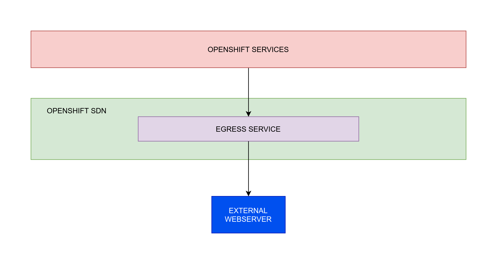
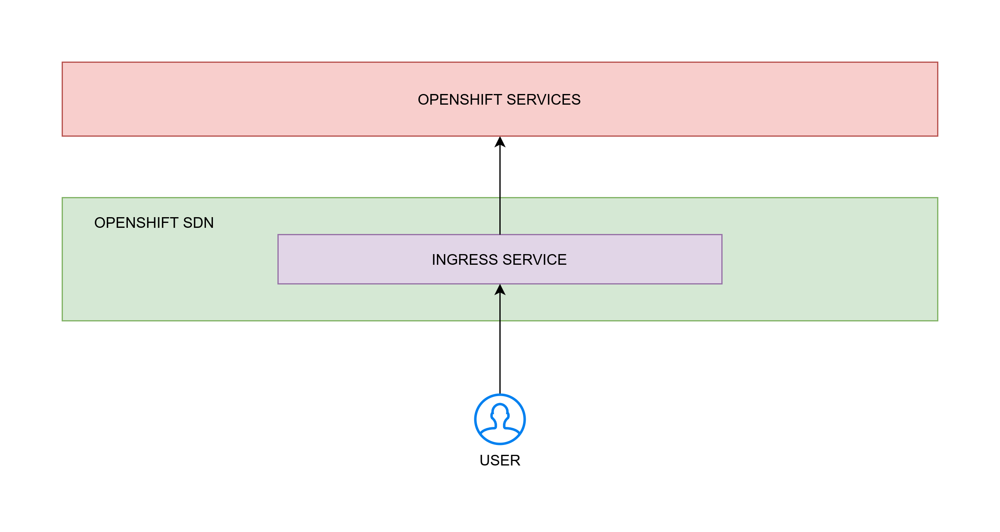

==== Networking Overview

Kubernetes ensures that pods are able to network with each other, and allocates each pod an IP address from an internal network. This ensures all containers within the pod behave as if they were on the same host. Giving each pod its own IP address means that pods can be treated like physical hosts or virtual machines in terms of port allocation, networking, naming, service discovery, load balancing, application configuration, and migration.

==== Egress and Ingress

Egress and Ingress are the components to connect traffic in North/South way in Openshift and Kubernetes.

Namely, you need to control your traffic outside and inside from Openshift to Internet and from Internet to Openshift.

===== Egress

Egress traffic is traffic going from OpenShift pods to external systems, outside of OpenShift. There are two main options for enabling egress traffic: Allow access to external systems from OpenShift physical node IPs or use egress router. In enterprise environments, egress routers are often preferred. They allow granular access from a specific pod, group of pods, or project to an external system or service. Access via node IP means all pods running on a given node can access external systems.

.Egress redirect

===== Ingress

OpenShift Container Platform provides methods for communicating from outside the cluster with services running in the cluster. This method uses an Ingress Controller.

Using an Ingress Controller is the most common way to allow external access to an OpenShift Container Platform cluster.

An Ingress Controller is configured to accept external requests and proxy them based on the configured routes. This is limited to HTTP, HTTPS using SNI, and TLS using SNI, which is sufficient for web applications and services that work over TLS with SNI.

The Ingress Controller:

* Has two replicas by default, which means it should be running on two worker nodes.

* Can be scaled up to have more replicas on more nodes.

.Ingress redirect

===== OpenShift Container Platform DNS

If you are running multiple services, such as front-end and back-end services for use with multiple pods, environment variables are created for user names, service IPs, and more so the front-end pods can communicate with the back-end services. If the service is deleted and recreated, a new IP address can be assigned to the service, and requires the front-end pods to be recreated to pick up the updated values for the service IP environment variable. Additionally, the back-end service must be created before any of the front-end pods to ensure that the service IP is generated properly, and that it can be provided to the front-end pods as an environment variable.

For this reason, OpenShift Container Platform has a built-in DNS so that the services can be reached by the service DNS as well as the service IP/port.

==== Openshift SDN

OpenShift Container Platform uses a software-defined networking (SDN) approach to provide a unified cluster network that enables communication between pods across the OpenShift Container Platform cluster. This pod network is established and maintained by the OpenShift SDN, which configures an overlay network using Open vSwitch (OVS).

===== OpenShift SDN network isolation modes

OpenShift SDN provides three SDN modes for configuring the pod network:

. *Network* policy mode allows project administrators to configure their own isolation policies using NetworkPolicy objects. Network policy is the default mode in OpenShift Container Platform 4.7.

. *Multitenant* mode provides project-level isolation for pods and services. Pods from different projects cannot send packets to or receive packets from pods and services of a different project. You can disable isolation for a project, allowing it to send network traffic to all pods and services in the entire cluster and receive network traffic from those pods and services.

. *Subnet* mode provides a flat pod network where every pod can communicate with every other pod and service. The network policy mode provides the same functionality as subnet mode.