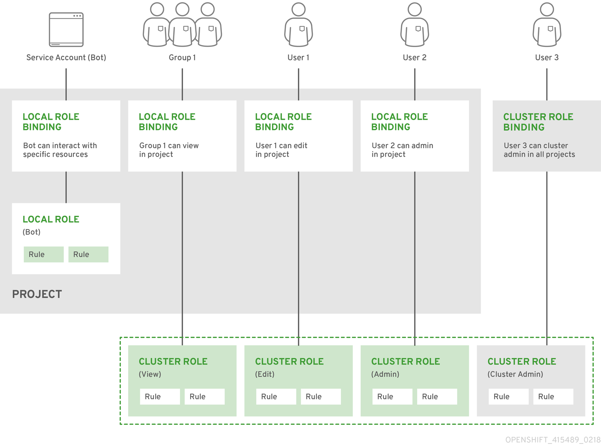

=== RBAC Overview

Role-based access control (RBAC) objects determine whether a user is allowed to perform a given action within a project.

Cluster administrators can use the cluster roles and bindings to control who has various access levels to the OpenShift Container Platform platform itself and all projects.

Developers can use local roles and bindings to control who has access to their projects. Note that authorization is a separate step from authentication, which is more about determining the identity of who is taking the action.

Authorization is managed using:

[cols=2*]
|===
|Authorization object |Description 

|Rules|Sets of permitted verbs on a set of objects. For example, whether a user or service account can create pods.

|Roles|Collections of rules. You can associate, or bind, users and groups to multiple roles.

|Bindings|Associations between users and/or groups with a role.
|===

There are two levels of RBAC roles and bindings that control authorization:

[cols=2*]
|===
|RBAC level|Description

|Cluster RBAC|Roles and bindings that are applicable across all projects. Cluster roles exist cluster-wide, and cluster role bindings can reference only cluster roles.

|Local RBAC|Roles and bindings that are scoped to a given project. While local roles exist only in a single project, local role bindings can reference both cluster and local roles.
|===

A cluster role binding is a binding that exists at the cluster level. A role binding exists at the project level. The cluster role view must be bound to a user using a local role binding for that user to view the project. Create local roles only if a cluster role does not provide the set of permissions needed for a particular situation.

This two-level hierarchy allows reuse across multiple projects through the cluster roles while allowing customization inside of individual projects through local roles.

During evaluation, both the cluster role bindings and the local role bindings are used. For example:

. Cluster-wide "allow" rules are checked.

. Locally-bound "allow" rules are checked.

. Deny by default.

=== Default cluster roles

OpenShift Container Platform includes a set of default cluster roles that you can bind to users and groups cluster-wide or locally. You can manually modify the default cluster roles, if required.

[colors=2*]
|===
|Default cluster role|Description

|admin|A project manager. If used in a local binding, an admin has rights to view any resource in the project and modify any resource in the project except for quota.

|basic-user|A user that can get basic information about projects and users.

|cluster-admin|A super-user that can perform any action in any project. When bound to a user with a local binding, they have full control over quota and every action on every resource in the project.

|cluster-status|A user that can get basic cluster status information.

|edit|A user that can modify most objects in a project but does not have the power to view or modify roles or bindings.

|self-provisioner|A user that can create their own projects.

|view|A user who cannot make any modifications, but can see most objects in a project. They cannot view or modify roles or bindings.
|===

Be mindful of the difference between local and cluster bindings. For example, if you bind the *cluster-admin* role to a user by using a local role binding, it might appear that this user has the privileges of a cluster administrator. This is not the case. Binding the *cluster-admin* to a user in a project grants super administrator privileges for only that project to the user. That user has the permissions of the cluster role *admin*, plus a few additional permissions like the ability to edit rate limits, for that project. This binding can be confusing via the web console UI, which does not list cluster role bindings that are bound to true cluster administrators. However, it does list local role bindings that you can use to locally bind *cluster-admin*.

The relationships between cluster roles, local roles, cluster role bindings, local role bindings, users, groups and service accounts are illustrated below.

.Roles relationships

=== Aggregated ClusterRoles 

You can _aggregate_ several ClusterRoles into one combined _ClusterRole_. A controller, running as part of the cluster control plane, watches for ClusterRole objects with an _aggregationRule_ set. The _aggregationRule_ defines a label selector that the controller uses to match other ClusterRole objects that should be combined into the rules field of this one.

