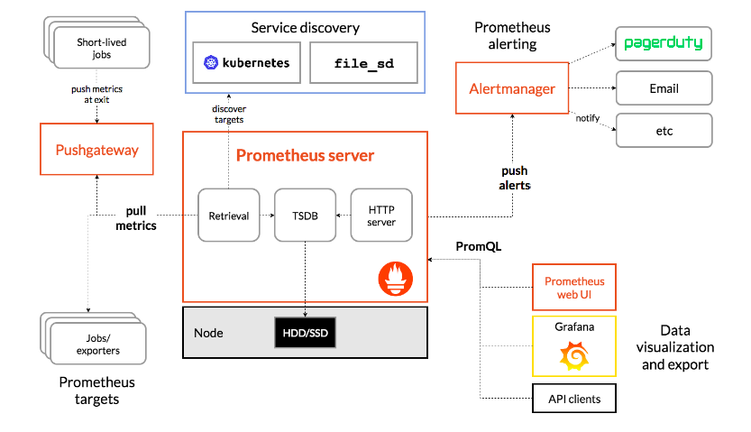
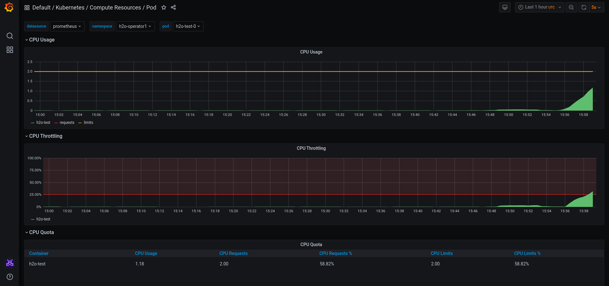

=== Prometheus

Prometheus is an open-source systems monitoring and alerting toolkit originally built at SoundCloud. It is now a standalone open source project and maintained independently of any company. To emphasize this, Prometheus joined the Cloud Native Computing Foundation in 2016 as the second hosted project, after Kubernetes.

==== Features

Prometheus's main functionalities are:

* A multi-dimensional data model with time series data identified by metric name and key/value pairs
* PromQL, a flexible query language to leverage this dimensionality
* No reliance on distributed storage; single server nodes are autonomous
* Time series collection happens via a pull model over HTTP
* Pushing time series is supported via an intermediary gateway
* Targets are discovered via service discovery or static configuration
* Multiple modes of graphing and dashboarding support

==== Components

The Prometheus ecosystem consists of the following multiple components, which some are optional:

* The main Prometheus server which scrapes and stores time series data
* Client libraries for instrumenting application code
* A push gateway for supporting short-lived jobs
* Special-purpose exporters for services like HAProxy, StatsD, Graphite, etc.
* An alertmanager to handle alerts
* various support tools

==== Architecture

The architecture of Prometheus and its ecosystem components are illustrated in the following diagram:

Prometheus scrapes metrics from instrumented jobs, either directly or via an intermediary push gateway for short-lived jobs. It stores all scraped samples locally and runs rules over this data to either aggregate and record new time series from existing data or generate alerts. Then the collected data can be visualized using Grafana, which is explained later on.

==== Monitoring with Prometheus

After installing OpenShift Container Platform 4.6, cluster administrators can optionally enable monitoring for user-defined projects. By using this feature, cluster administrators, developers, and other users can specify how services and pods are monitored in their own projects. You can then query metrics, review dashboards, and manage alerting rules and silences for your own projects in the OpenShift Container Platform web console.

IMPORTANT: Monitoring of user-defined projects is not enabled by default. To enable it, you need to modify a Configmap of the openshift-monitoring. You need permissions to create and modify Configmaps in this project. You only have to execute this command once per namespace. An implementation of this can be found https://github.com/alvarolop/rhdg8-server/blob/main/templates/rhdg-02-ocp-user-workload-monitoring.yaml[here].

More information, access the Openshift https://docs.openshift.com/container-platform/4.6/monitoring/understanding-the-monitoring-stack.html[documentation] on the monitoring stack, Prometheus https://github.com/prometheus/prometheus[documentation] and the Prometheus Operator https://github.com/prometheus-operator/prometheus-operator[documentation].

=== Grafana

Grafana is an open-source platform for monitoring and observability. +
Grafana allows you to query, visualize, alert on and understand your metrics no matter where they are stored. Create, explore, and share dashboards with your team and foster a data driven culture:

- *Visualize:* Fast and flexible client side graphs with a multitude of options. Panel plugins offer many different ways to visualize metrics and logs.
- *Dynamic Dashboards:* Create dynamic & reusable dashboards with template variables that appear as dropdowns at the top of the dashboard.
- *Explore Metrics:* Explore your data through ad-hoc queries and dynamic drilldown. Split view and compare different time ranges, queries and data sources side by side.
- *Explore Logs:* Experience the magic of switching from metrics to logs with preserved label filters. Quickly search through all your logs or streaming them live.
- *Alerting:* Visually define alert rules for your most important metrics. Grafana will continuously evaluate and send notifications to systems like Slack, PagerDuty, VictorOps, OpsGenie.
- *Mixed Data Sources:* Mix different data sources in the same graph! You can specify a data source on a per-query basis. This works for even custom datasources.

==== Monitoring with Grafana

A typical OpenShift monitoring stack includes Prometheus for monitoring both systems and services, and Grafana for analyzing and visualizing metrics.

.Example dashboard in Grafana to monitor different pod metrics

Administrators are often looking to write custom queries and create custom dashboards in Grafana. However, Grafana instances provided with the monitoring stack (and its dashboards) are read-only. To solve this problem, we can use the community-powered Grafana operator provided by OperatorHub.

To deploy the community-powered Grafana operator on OCP 4.6 just follow these https://github.com/alvarolop/rhdg8-server#monitoring-rhdg-with-grafana[steps].

For more information, access the Grafana https://grafana.com/docs/grafana/latest/[main documentation] or the Grafana https://github.com/integr8ly/grafana-operator/blob/v3.6.0/README.md[operator documentation].

