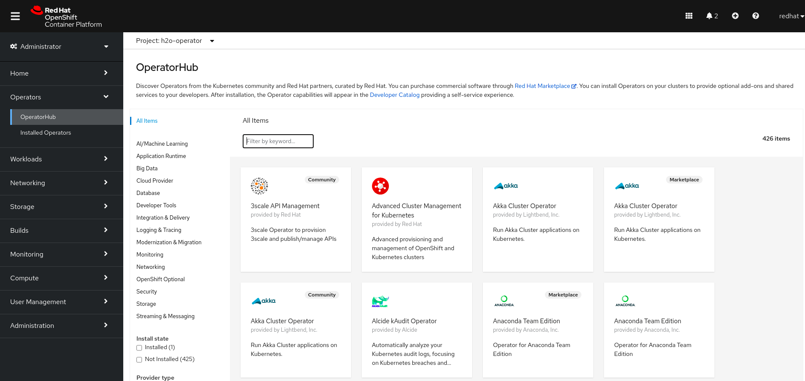
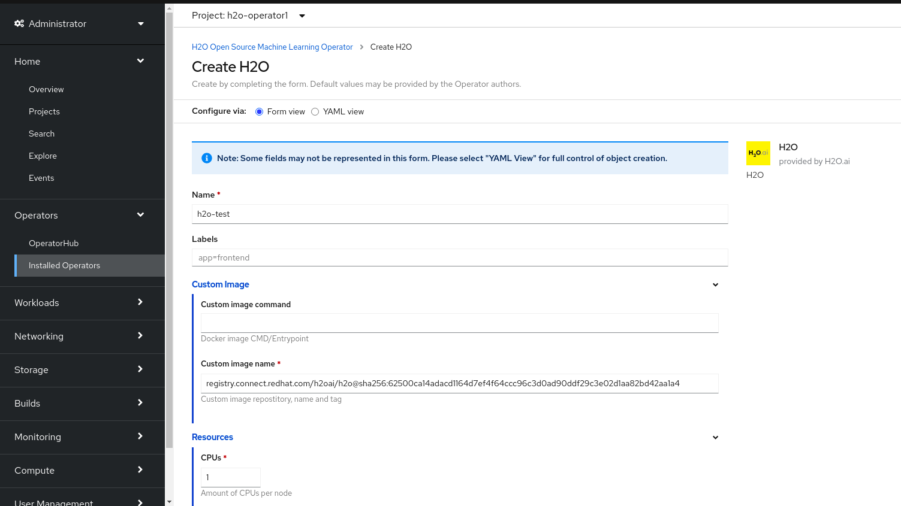

=== Introduction

The goal of an Operator is to put operational knowledge into software. Previously this knowledge only resided in the minds of administrators, various combinations of shell scripts or automation software like Ansible. It was outside of your Kubernetes cluster and hard to integrate. With Operators, CoreOS changed that.

Operators implement and automate common Day-1 (installation, configuration, etc) and Day-2 (re-configuration, update, backup, failover, restore, etc.) activities in a piece of software running inside your Kubernetes cluster, by integrating natively with Kubernetes concepts and APIs. We call this a Kubernetes-native application. With Operators you can stop treating an application as a collection of primitives like Pods, Deployments, Services or ConfigMaps, but instead as a single object that only exposes the knobs that make sense for the application.

=== How are Operators created

The premise of an Operator is to have it be a custom form of Controllers, a core concept of Kubernetes. A controller is basically a software loop that runs continuously on the Kubernetes master nodes. In these loops the control logic looks at certain Kubernetes objects of interest. It audits the desired state of these objects, expressed by the user, compares that to what’s currently going on in the cluster and then does anything in its power to reach the desired state.

.Available operators in the OperatorHub from OCP


This declarative model is basically the way a user interacts with Kubernetes. Operators apply this model at the level of entire applications. They are in effect application-specific controllers. This is possible with the ability to define custom objects, called Custom Resource Definitions (CRD).

The Operator itself is a piece of software running in a Pod on the cluster, interacting with the Kubernetes API server. That’s how it gets notified about the presence or modification of objects defined in the CRD. That’s also when it will start running its loop to ensure that the application service is actually available and configured in the way the user expressed in the specification of the CRD. This is called a reconciliation loop.

A template to deploy the **H2O** operator is presented:

[source,shell]
----
apiVersion: template.openshift.io/v1
kind: Template
metadata:
  name: h2o-operator
  annotations:
    description: Template to deploy a H2O operator on OCP.
    tags: h2o,operator
    iconClass: icon-h20
    openshift.io/provider-display-name: Red Hat, Inc.
    openshift.io/support-url: https://access.redhat.com
objects:
- apiVersion: project.openshift.io/v1
  kind: Project
  metadata:
    name: ${OPERATOR_NAMESPACE}
    annotations:
      openshift.io/description: "This project contains all the resources related to the operator of H2O"
      openshift.io/display-name: "H2O - Operator"
- apiVersion: operators.coreos.com/v1
  kind: OperatorGroup
  metadata:
    name: h2oai
    namespace: ${OPERATOR_NAMESPACE}
  spec:
    targetNamespaces:
      - ${OPERATOR_NAMESPACE}
- apiVersion: operators.coreos.com/v1alpha1
  kind: Subscription # subscribe to the operator to make it available to developers
  metadata:
    name: h2o-operator
    namespace: ${OPERATOR_NAMESPACE} # just install operator in a concrete namespace
  spec:
    channel: beta # specific channel to subscribe to
    installPlanApproval: Automatic 
    name: h2o-operator # name of the operator
    source: certified-operators
    sourceNamespace: openshift-marketplace
parameters:
- name: OPERATOR_NAMESPACE
  description: "The project where the operator will be installed."
  required: false
  value: "h2o-operator1"
- name: CLUSTER_NAMESPACE
  description: "The project where the H2O cluster will be installed."
  required: false
  value: "h2o"
----
During installation, you must determine the following initial settings for the Operator:

**Installation Mode** +
It can be chosen to install the Operator on all namespaces or a individual namespaces. In the previous example it is installed in `${OPERATOR_NAMESPACE}`.

**Update Channel** +
If an Operator is available through multiple channels, you can choose which channel you want to subscribe to. In the previous example it was chosen the `beta` channel.

**Approval Strategy** +
You can choose Automatic or Manual updates. If you choose Automatic updates for an installed Operator, when a new version of that Operator is available, the Operator Lifecycle Manager, which is explained later on, automatically upgrades the running instance of your Operator without human intervention. If you select Manual updates, when a newer version of an Operator is available, the OLM creates an update request. As a cluster administrator, you must then manually approve that update request to have the Operator updated to the new version. In the previous example it was chosen `Automatic` updates.


More examples on how to deploy an operator into a OCP4 cluster can be found here:

* https://github.com/hect1995/h2o-ocp
* https://github.com/alvarolop/rhdg8-server

=== Custom Resource Definitions

In the Kubernetes API, a resource is an endpoint that stores a collection of API objects of a certain kind. For example, the built-in Pods resource contains a collection of Pod objects.

A __Custom Resource Definition__ (CRD) object defines a new, unique object `Kind` in the cluster and lets the Kubernetes API server handle its entire lifecycle.

__Custom Resource__ (CR) objects are created from CRDs that have been added to the cluster by a cluster administrator, allowing all cluster users to add the new resource type into projects.

When a cluster administrator adds a new CRD to the cluster, the Kubernetes API server reacts by creating a new RESTful resource path that can be accessed by the entire cluster or a single project (namespace) and begins serving the specified CR.

[source,shell]
----
 - apiVersion: h2o.ai/v1beta
  kind: H2O # Specify the type in the custom resource definition
  metadata:
    name: ${APPLICATION_NAME} # Specify a name for the object
    namespace: ${OPERATOR_NAMESPACE}
  spec: # Specify conditions specific to the type of object
    nodes: 1
    resources:
      cpu: 2
      memory: 2Gi
      memoryPercentage: 90
    customImage:
      image: >-
        registry.connect.redhat.com/h2oai/h2o@sha256:62500ca14adacd1164d7ef4f64ccc96c3d0ad90ddf29c3e02d1aa82bd42aa1a4
parameters:
- name: APPLICATION_NAME
  description: "The H2O application name."
  required: false
  value: "h2o-test"
- name: OPERATOR_NAMESPACE
  description: "The project where the operator will be installed."
  required: false
  value: "h2o-operator1"
----
In the previous example, a __CR__ object of type **H2O** is generated. The __CRD__ with the declaration is self embedded in the H2O operator deployed previously.

Any __CR__ object can be inspected by running:

`$ oc get <kind>`

For example:
```
$ oc get H2O
NAME       AGE
h2o-test   24m

$ oc get H2O -o yaml # to get more more information in YAML format
```

Operators in particular make use of CRDs by packaging them with any required RBAC policy and other software-specific logic. Cluster administrators can also add CRDs manually to the cluster outside of an Operator’s lifecycle, making them available to all users.

Cluster administrators that want to grant access to the CRD to other users can use cluster role aggregation to grant access to users with the `admin`, `edit`, or `view` default cluster roles. Cluster role aggregation allows the insertion of custom policy rules into these cluster roles. This behavior integrates the new resource into the cluster’s RBAC policy as if it was a built-in resource.

Further information on how to create a CRD and assign cluster roles to it can be found in the official https://docs.openshift.com/container-platform/4.2/operators/crds/crd-extending-api-with-crds.html#crd-creating-custom-resources-definition_crd-extending-api-with-crds[documentation].

=== Operator Lifecycle Manager

In OpenShift Container Platform 4, the __Operator Lifecycle Manager__ (OLM) helps users install, update, and manage the lifecycle of all Operators and their associated services running across their clusters. It is part of the https://github.com/operator-framework[Operator Framework], an open source toolkit designed to manage Kubernetes native applications (Operators) in an effective, automated, and scalable way.

The OLM runs by default in OpenShift Container Platform 4, which aids cluster administrators in installing, upgrading, and granting access to Operators running on their cluster. The OpenShift Container Platform web console provides management screens for cluster administrators to install Operators, as well as grant specific projects access to use the catalog of Operators available on the cluster.

.Create a new application instance using the operator


For developers, a self-service experience allows provisioning and configuring instances of databases, monitoring, and big data services without having to be subject matter experts, because the Operator has that knowledge baked into it.

The following __CRDs__ are defined and managed by __OLM__:

.Table 1. CRDs managed by OLM and Catalog Operators

|===
|Resource |Short name |Description

|ClusterServiceVersion (CSV) |csv |Application metadata. For example: name, version, icon, required resources.

|CatalogSource |catsrc |A repository of CSVs, CRDs, and packages that define an application.

|Subscription |sub |Keeps CSVs up to date by tracking a channel in a package.

|InstallPlan |ip |Calculated list of resources to be created to automatically install or upgrade a CSV.

|OperatorGroup |og |Configures all Operators deployed in the same namespace as the OperatorGroup object to watch for their custom resource (CR) in a list of namespaces or cluster-wide.

|===

More information about OLM can be found https://docs.openshift.com/container-platform/4.5/operators/understanding/olm/olm-understanding-olm.html#olm-resources_olm-understanding-olm[here].